# AsIO3.sys

> ASRock/ASUS hardware access driver that exposes physical memory reads/writes, MSR access, and an `ObfDereferenceObject` decrement primitive

## Summary

| Field | Value |
|-------|-------|
| **Driver** | `AsIO3.sys` |
| **Vendor** | ASRock / ASUS |
| **Vulnerability Class** | Arbitrary R/W / Physical Memory Mapping / Authorization Bypass |
| **Abused Version** | Multiple versions shipped with ASRock and ASUS utilities |
| **Status** | Blocklisted — included in Microsoft Vulnerable Driver Blocklist |
| **Exploited ITW** | Yes |
| **Related CVEs** | [CVE-2025-1533](CVE-2025-1533.md) (stack overflow), [CVE-2025-3464](CVE-2025-3464.md) (auth bypass) |

## The Story

Most BYOVD drivers are blunt instruments: they give you physical memory access and you walk page tables. `AsIO3.sys` is more interesting because it offers an unusual primitive alongside the standard ones. Cisco Talos researcher Marcin Noga demonstrated a complete SYSTEM escalation chain using not the physical memory IOCTLs, but a single `ObfDereferenceObject` call that decrements any address by one. The title of the Talos blog post says it all: "Decrement by one to rule them all."

The driver ships with ASRock and some ASUS motherboard utilities. Swapcontext first documented it when adding it as a KDU provider in v1.1. It provides the usual physical memory and MSR access, filtered through allowlists that attempt to restrict the most dangerous operations. But IOCTL `0xa0402450` has no restrictions at all: it calls `ObfDereferenceObject` on a user-supplied address, effectively decrementing the value at `(address - 0x30)` by one.

The driver's authorization model also has a critical flaw. It relies on SHA256 hash verification of the calling process's executable path ([CVE-2025-3464](CVE-2025-3464.md)), which an attacker bypasses trivially with a hardlink. And the `IRP_MJ_CREATE` handler contains a stack buffer overflow in `Win32PathToNtPath` ([CVE-2025-1533](CVE-2025-1533.md)) due to a `MAX_PATH` length assumption.

## BYOVD Context

- **Driver signing**: Authenticode-signed by ASRock Incorporation with valid certificate
- **Vulnerable Driver Blocklist**: Included in Microsoft's recommended driver block rules
- **HVCI behavior**: Blocked on HVCI-enabled systems via the blocklist
- **KDU integration**: Integrated as a KDU provider (added in KDU v1.1)
- **LOLDrivers**: Listed at loldrivers.io

## Affected IOCTLs

| IOCTL | Capability | Notes |
|-------|-----------|-------|
| `0xA040200C` | Physical memory R/W via MmMapIoSpace | Range-filtered by `checkPhyMemoryRange` / `g_goodRanges` |
| — | I/O port read/write | Direct port access |
| `0xA040A45C` | MSR read/write | Allowlist filtering; excludes IA32_LSTAR and IA32_SYSENTER_EIP |
| `0xa0402450` | `ObfDereferenceObject` on controlled address | Provides decrement-by-one primitive at `(addr - 0x30)` |

## The Decrement-by-One Chain

The Talos exploitation chain is elegant in its simplicity. The attacker bypasses authorization through a hardlink attack, making their executable's path hash-match the expected utility. Then they leak the current thread's `KTHREAD` address via `NtQuerySystemInformation` with handle enumeration. With the `KTHREAD` address known, a single IOCTL `0xa0402450` call decrements `KTHREAD.PreviousMode` at offset `0x232` from `UserMode (1)` to `KernelMode (0)`.

Once `PreviousMode` equals zero, the game is over. Every subsequent `Nt*` syscall skips `ProbeForRead` and `ProbeForWrite` checks entirely, because the kernel believes the caller is already in kernel mode. The attacker now has full arbitrary read/write over the entire kernel address space using standard `NtReadVirtualMemory` and `NtWriteVirtualMemory`. From there, traversing `ActiveProcessLinks` to find the SYSTEM token and swapping it into the current process is routine. A SYSTEM shell follows.

```mermaid
sequenceDiagram
    participant A as Attacker
    participant D as AsIO3.sys
    participant K as Kernel

    rect rgb(30, 41, 59)
    A->>A: Hardlink bypass (SHA256 hash match)
    A->>D: Open device handle
    A->>K: NtQuerySystemInformation (leak KTHREAD)
    A->>D: IOCTL 0xa0402450 (target KTHREAD+0x232)
    D->>K: ObfDereferenceObject(KTHREAD+0x202)
    Note over K: PreviousMode: 1 → 0
    A->>K: NtReadVirtualMemory (read SYSTEM token)
    A->>K: NtWriteVirtualMemory (swap token)
    Note over A: SYSTEM shell
    end
```



### Via KDU (Physical Memory)

The KDU path is the simpler alternative: load the signed driver, open the device, map physical addresses via the `MmMapIoSpace` IOCTL (which has range filtering but can still reach useful regions), walk page tables, and modify kernel structures. For advanced attacks, mapping SMRAM provides access to SMM code and data.

## Detection

### YARA Rule

```yara
rule AsIO3_sys {
    meta:
        description = "Detects ASRock/ASUS AsIO3.sys vulnerable driver"
        author = "KernelSight"
        severity = "critical"
    strings:
        $mz = { 4D 5A }
        $driver_name = "AsIO3" wide ascii nocase
        $asrock = "ASRock" wide ascii
        $asio = "AsIO" wide ascii
    condition:
        $mz at 0 and ($driver_name or $asio) and $asrock
}
```

### ETW Indicators

| Provider | Event / Signal | Relevance |
|----------|---------------|-----------|
| Microsoft-Windows-Kernel-File | Driver load event | Detects loading of AsIO3.sys |
| Sysmon | Event ID 6 — Driver loaded | Hash and signature capture |
| Microsoft-Windows-Security-Auditing | Event 4697 — Service installed | Driver service creation |
| Microsoft-Windows-Kernel-Process | Process token modification | Post-exploitation token swap |

### Behavioral Indicators

- Loading of `AsIO3.sys` from outside ASRock utility installation directories
- Physical memory mapping targeting SMRAM address ranges (typically 0xA0000-0xBFFFF or chipset-defined regions)
- MSR read/write IOCTLs from non-utility processes
- Privilege escalation following AsIO3 driver interaction

## Techniques Used

| Technique | KernelSight Page |
|-----------|-----------------|
| Arbitrary Decrement (ObfDereferenceObject) | [Arb Increment/Decrement](../primitives/arw/arb-increment-decrement.md) |
| PreviousMode Manipulation | [PreviousMode Manipulation](../primitives/exploitation/previous-mode-manipulation.md) |
| Token Swapping | [Token Swapping](../primitives/exploitation/token-swapping.md) |
| Physical Memory Mapping | [Direct IOCTL R/W](../primitives/arw/direct-ioctl-rw.md) |

## Broader Significance

`AsIO3.sys` is a textbook example of how a single decrement primitive can be as powerful as full arbitrary read/write. The `PreviousMode` flip technique turns a minimal primitive (subtract one from any address) into unrestricted kernel access, bypassing all user/kernel boundary enforcement. This pattern appears repeatedly in Windows kernel exploitation: when you can write even a single byte at a controlled location, `PreviousMode` at a known `KTHREAD` offset is often the shortest path to SYSTEM.

## References

- [Talos — Decrement by one to rule them all: AsIO3.sys driver exploitation](https://blog.talosintelligence.com/decrement-by-one-to-rule-them-all/)
- [swapcontext — KDU v1.1 Release and bonus: AsIO3.sys](https://swapcontext.blogspot.com/2021/04/kdu-v11-release-and-bonus-asio3sys.html)
- [LOLDrivers — AsIO3](https://www.loldrivers.io/)
- [CVE-2025-1533 — Stack overflow in Win32PathToNtPath](CVE-2025-1533.md)
- [CVE-2025-3464 — Authorization bypass and full exploit chain](CVE-2025-3464.md)
