# CVE-2022-21882

> Win32k, ConsoleWindow flag misinterprets WndExtra causing type confusion EoP

!!! danger "Exploited in the Wild"
    This vulnerability was exploited in the wild before or shortly after patching.

## Summary

| Field | Value |
|-------|-------|
| **Driver** | `win32kbase.sys` |
| **Vulnerability Class** | Type Confusion |
| **Vulnerable Build** | `10.0.22621.1` (RTM) |
| **Fixed Build** | `10.0.22621.382` (KB5019509) |
| **Exploited ITW** | Yes |

## The Story

Win32k has been the single largest source of kernel privilege escalation bugs in Windows history. CVE-2022-21882 is a type confusion in `win32kbase.sys` that was exploited in the wild, and it showcases a pattern unique to the Win32k subsystem: reentrant callbacks that allow user-mode code to modify kernel state mid-operation.

The bug lies in how Win32k handles window objects when the ConsoleWindow flag is set. Under normal circumstances, the WndExtra region of a window structure holds opaque, application-defined bytes. But when the ConsoleWindow flag is present, the kernel reinterprets that same region as a pointer to an internal `tagWND` structure. The same memory, two different types, depending on which code path executes.

## Affected Functions

- `xxxClientAllocWindowClassExtraBytes`
- `NtUserConsoleControl`

## The Root Cause as It Happens

Here is what happens step by step. A normal window is created, and its WndExtra region contains application data. Then `NtUserConsoleControl` is called on that window, setting the ConsoleWindow flag. This changes how the kernel interprets WndExtra, but the data in WndExtra has not changed; it still contains whatever the application put there.

During the subsequent `xxxClientAllocWindowClassExtraBytes` callback, something crucial happens: `NtCallbackReturn` can replace the window's WndExtra contents with controlled data. The kernel returns from the callback and finds WndExtra populated with what it now believes is a valid `tagWND` pointer, because the ConsoleWindow flag tells it to interpret the data that way. A subsequent operation dereferences the supplied value as a kernel object.

This is the classic Win32k reentrant callback vulnerability pattern: the kernel calls back to user mode, user mode modifies shared state, and the kernel continues operating on assumptions that no longer hold.

AutoPiff categorizes this as **type_confusion** with detection rules:

- `object_type_validation_added`
- `handle_object_type_check_added`

## From Type Confusion to SYSTEM

The type confusion provides a controlled pointer dereference inside the kernel, which the attacker pivots into an arbitrary write primitive. The attacker creates a normal window, calls `NtUserConsoleControl` to set the ConsoleWindow flag, and then during the `xxxClientAllocWindowClassExtraBytes` callback, uses `NtCallbackReturn` to inject a pointer to a fake `tagWND` structure at a known user-mode address.

When the kernel returns from the callback, it reads the fake `tagWND` and follows the controlled pointers embedded within it. The fake structure is crafted so that its internal fields (the extra-bytes buffer pointer and associated offsets) redirect a later kernel write to an arbitrary address. This yields a write-what-where primitive.

The Win32k desktop heap is deterministic enough that a desktop heap spray (allocating many window objects of known size) positions the fake structure at a calculable offset, eliminating the need for a separate information leak in most scenarios. The standard escalation path is to overwrite the current process's `EPROCESS` token with the SYSTEM process token.

```mermaid
sequenceDiagram
    participant U as User-Mode
    participant W as win32kbase.sys
    participant H as Desktop Heap

    rect rgb(30, 41, 59)
    U->>W: CreateWindow (normal window)
    U->>W: NtUserConsoleControl (set ConsoleWindow flag)
    Note over W: WndExtra now interpreted as tagWND*
    W->>U: xxxClientAllocWindowClassExtraBytes callback
    U->>U: Craft fake tagWND at known address
    U->>W: NtCallbackReturn (inject fake tagWND ptr)
    W->>H: Dereference fake tagWND pointer
    Note over W: Follows controlled pointers
    W->>H: Write via redirected buffer pointer
    Note over U: Write-what-where achieved
    U->>U: Token swap → SYSTEM
    end
```



## Patch Analysis

The patch adds explicit object type validation when processing windows that carry the ConsoleWindow flag. Before the fix, the kernel blindly cast the WndExtra data to a `tagWND*` without verifying that the referenced memory actually belonged to a valid window object. In the patched build, the code checks the object type before dereferencing: if the WndExtra value does not point to a legitimate `tagWND` allocated through the expected kernel pool path, the operation is rejected and the potentially corrupted pointer is never followed.

AutoPiff detects this behavioral change through the `object_type_validation_added` and `handle_object_type_check_added` rules, which flag functions where the patched binary introduces type-tag or handle-table validation that was absent in the vulnerable build.

## Detection

### YARA Rule

```yara
rule CVE_2022_21882_Win32k {
    meta:
        description = "Detects vulnerable version of win32kbase.sys (pre-patch)"
        cve = "CVE-2022-21882"
        author = "KernelSight"
        severity = "high"
    strings:
        $mz = { 4D 5A }
        $driver_name = "win32kbase.sys" wide ascii nocase
        $vuln_build = "10.0.22621.1" wide ascii
        $func_alloc_extra = "xxxClientAllocWindowClassExtraBytes" ascii
        $func_console_ctrl = "NtUserConsoleControl" ascii
    condition:
        $mz at 0 and $driver_name and $vuln_build and ($func_alloc_extra or $func_console_ctrl)
}
```

### ETW Indicators

| Provider | Event / Signal | Relevance |
|----------|---------------|-----------|
| Microsoft-Windows-Win32k | Window creation / class registration events | Detects creation of windows whose WndExtra region is later reinterpreted via the ConsoleWindow flag |
| Microsoft-Windows-Win32k | Console control operations | Fires when `NtUserConsoleControl` sets the ConsoleWindow flag on an existing window, the key step in triggering the type confusion |
| Microsoft-Windows-Kernel-Audit | Token modification events | Detects the EPROCESS token overwrite from standard user to SYSTEM following the write-what-where primitive |
| Microsoft-Windows-Security-Auditing | Event ID 4672 (Special privileges assigned) | Low-privilege GUI process suddenly acquiring SeDebugPrivilege or SeTcbPrivilege after Win32k callback manipulation |
| Microsoft-Windows-Security-Auditing | Event ID 4688 (Process creation) | Post-exploitation child process running as SYSTEM spawned from a desktop application context |

### Behavioral Indicators

- Window creation followed by `NtUserConsoleControl` to set the ConsoleWindow flag, then `xxxClientAllocWindowClassExtraBytes` callback processing; this syscall sequence is specific to CVE-2022-21882 exploitation
- During the callback, `NtCallbackReturn` called with crafted data to replace WndExtra contents with a pointer to a fake `tagWND` in user-mode memory
- Desktop heap spray: rapid creation of many identically-sized window objects to position the fake `tagWND` at a predictable offset
- EPROCESS token overwrite resulting in SYSTEM privileges from a medium or low integrity context
- Post-exploitation actions inconsistent with the original GUI application role (LSASS access, service modification, SYSTEM command shells)

## Broader Significance

CVE-2022-21882 belongs to the Win32k reentrant callback class, a vulnerability pattern where user-mode callbacks during kernel operations allow state modification that the kernel does not expect. This pattern has produced dozens of Win32k EoP bugs over the years. The specific combination of type confusion and callback reentrancy makes Win32k uniquely fertile ground for exploitation: the kernel's trust in its own type interpretations can be undermined by user-mode code running in the middle of a kernel operation.

## References

- [MSRC Advisory](https://msrc.microsoft.com/update-guide/vulnerability/CVE-2022-21882)
- [Writeup](https://googleprojectzero.github.io/0days-in-the-wild/0day-RCAs/2022/CVE-2022-21882.html)
- [PoC](https://github.com/KaLendsi/CVE-2022-21882)
