# CVE-2024-11616

> epdlpdrv.sys -- Netskope Endpoint DLP double-fetch heap overflow

## Summary

| Field | Value |
|-------|-------|
| **Driver** | `epdlpdrv.sys` (Netskope Endpoint DLP) |
| **Vendor** | Netskope |
| **Vulnerability Class** | Double-Fetch (TOCTOU) |
| **Exploited ITW** | No |
| **Patch Date** | 2024 |

## Root Cause

The Netskope Endpoint DLP driver (`epdlpdrv.sys`) communicates with its user-mode service through a filter port. The driver's message handler reads a length field from the user-supplied input buffer at offset `InputBuffer+0xc` to determine how much data to process. The problem is that this length field is read twice: once to calculate the size of a kernel pool allocation via `ExAllocatePoolWithTag`, and again to set the copy length for `RtlCopyMemory`.

Between these two reads, the length value sits in user-mode memory. The driver does not capture it into a kernel-side variable after the first read. This creates a classic double-fetch TOCTOU window: a second thread in the attacker's process can flip the value between the two reads. The attacker arranges for the first read to return a small value (producing a small pool allocation) and the second read to return a large value (causing `RtlCopyMemory` to copy far more data than the buffer can hold). The result is a heap buffer overflow in kernel pool.

There is an additional prerequisite: the communication port to `epdlpdrv.sys` accepts only one concurrent connection, which is normally held by the Netskope EPDLP user-mode service. The attacker must first kill that service to free the port before connecting.

```mermaid
sequenceDiagram
    participant Attacker as Attacker Thread 1
    participant Racer as Attacker Thread 2
    participant Driver as epdlpdrv.sys
    participant Pool as Kernel Pool

    Note over Attacker,Racer: User-mode memory at InputBuffer+0xc<br/>initially set to small value

    Attacker->>Driver: Send message on filter port
    Driver->>Attacker: Read length (small) from InputBuffer+0xc
    Driver->>Pool: ExAllocatePoolWithTag(small)
    Pool-->>Driver: Small buffer allocated

    rect rgb(30, 41, 59)
        Note over Racer: Race window
        Racer->>Racer: Flip InputBuffer+0xc to large value
    end

    Driver->>Attacker: Read length (large) from InputBuffer+0xc
    Driver->>Pool: RtlCopyMemory(small_buf, data, large)
    Note over Pool: Heap overflow into adjacent objects
```



## Exploitation

The exploitation sequence begins by terminating the Netskope EPDLP service to free the driver's single communication port. The attacker then connects to the port and sets up two threads: one to send a message containing the crafted input buffer, and another to race the length field modification.

The racing thread monitors memory access patterns (or simply spins in a tight loop) to flip the length value at `InputBuffer+0xc` from a small value to a large value between the driver's two reads. When the race is won, the driver allocates a small buffer but copies a large amount of data into it, overflowing into adjacent pool objects.

In the published PoC, the overflow triggers a BSOD by corrupting pool metadata. A weaponized exploit would use pool feng shui to position a target object (such as a pipe attribute or event object) adjacent to the vulnerable allocation, then corrupt specific fields in that object to build a read/write primitive. From there, the standard token swap achieves SYSTEM.

### Exploitation Primitive

```
Kill EPDLP service -> connect to driver port
  -> race length field (small alloc, large copy)
  -> heap overflow -> pool corruption -> BSOD / potential code exec
```

## Broader Significance

CVE-2024-11616 is a textbook double-fetch vulnerability. The pattern of reading a user-mode value twice without capturing it into a kernel variable is one of the most commonly taught TOCTOU classes in kernel security, yet it continues to appear in production drivers. Security product drivers like endpoint DLP agents run at high privilege and often implement custom communication channels (filter ports, shared memory) that bypass the standard I/O manager buffering. This creates exactly the kind of raw user-mode memory access that makes double-fetch bugs possible. The irony of a security product's own driver being the vulnerability is not lost on the research community.

## References

- [Inbits Writeup](https://inbits-sec.com/posts/cve-2024-11616-netskope/)
- [PoC (GitHub)](https://github.com/inb1ts/CVE-2024-11616)
- [Netskope Advisory NSKPSA-2024-003](https://www.netskope.com/company/security-compliance-and-assurance/security-advisories-and-disclosures/netskope-security-advisory-nskpsa-2024-003)
