# CVE-2024-30084

> Cloud Files Mini Filter -- TOCTOU race condition

## Summary

| Field | Value |
|-------|-------|
| **Driver** | `cldflt.sys` |
| **Vulnerability Class** | Race Condition / TOCTOU |
| **Exploited ITW** | No |
| **CVSS** | 7.0 |

## Root Cause

The Cloud Files Mini Filter (`cldflt.sys`) intercepts file system operations on cloud-backed files, managing the hydration and dehydration of OneDrive placeholders and other cloud storage providers. When the driver processes certain requests, it validates a user-mode buffer or state variable and then uses that validated value in a subsequent operation. The problem is that no synchronization primitive (lock, mutex, or interlocked operation) protects the window between the validation and the use.

A second thread in the same process can modify the validated data after the driver has checked it but before the driver acts on it. This is a textbook TOCTOU (time-of-check-to-time-of-use) race condition. The specific state that can be modified between check and use provides a limited write primitive when the race is won.

This vulnerability gained prominence because DEVCORE researcher Angelboy used it at Pwn2Own Vancouver 2024 as part of a chain to compromise Windows 11. The `cldflt.sys` race provided the initial primitive, which was then combined with CVE-2024-35250 (a kernel streaming untrusted pointer dereference in `ks.sys`) to achieve full kernel read/write and SYSTEM escalation.

```mermaid
sequenceDiagram
    participant T1 as Attacker Thread 1
    participant Driver as cldflt.sys
    participant T2 as Attacker Thread 2
    participant KS as ks.sys (CVE-2024-35250)

    T1->>Driver: Request with user-mode buffer
    Driver->>Driver: Validate buffer contents
    Note over Driver: Check passes

    rect rgb(30, 41, 59)
        Note over T2: Race window
        T2->>T2: Modify validated buffer
    end

    Driver->>Driver: Use (now-modified) buffer
    Note over Driver: Limited write primitive

    Note over T1,KS: Chain with CVE-2024-35250
    T1->>KS: Exploit untrusted pointer deref
    KS-->>T1: Full kernel R/W
    T1->>T1: Token swap to SYSTEM
```

## Exploitation

On its own, the TOCTOU race in `cldflt.sys` provides a limited write primitive that is difficult to weaponize into full kernel compromise. The Pwn2Own chain demonstrates why vulnerability chaining matters: the limited primitive from `cldflt.sys` was sufficient to set up the conditions needed to trigger CVE-2024-35250 in `ks.sys`, which provides a clean, deterministic kernel read/write. Together, the two bugs form a complete exploitation chain from standard user to SYSTEM.

Winning the race requires multi-threaded coordination: one thread issues the request that triggers the validation, while a second thread continuously flips the buffer contents, hoping to hit the window between the driver's check and use. The window is narrow, so multiple attempts may be needed, but the operation is safe to retry (failed attempts do not cause crashes).

## Patch Analysis

The fix adds synchronization around the check-then-use sequence in `cldflt.sys`. The validated state is either captured into a kernel-side variable (eliminating the user-mode dependency) or protected by a lock that prevents concurrent modification between validation and consumption.

## Broader Significance

CVE-2024-30084 is the second vulnerability in `cldflt.sys` within a year (following CVE-2023-36036), and it appeared alongside CVE-2024-30085, another heap overflow in the same driver patched the same month. The Pwn2Own chain with CVE-2024-35250 demonstrates how modern exploitation often combines a "hard to exploit alone" bug with a "clean but needs setup" bug to produce a reliable chain. For defenders, this means that individual bug severity ratings can be misleading: a CVSS 7.0 race condition becomes a full compromise when paired with the right second bug.

## References

- [MSRC Advisory](https://msrc.microsoft.com/update-guide/vulnerability/CVE-2024-30084)
- [DEVCORE: Streaming Vulnerabilities Part I](https://devco.re/blog/2024/08/23/streaming-vulnerabilities-from-windows-kernel-proxying-to-kernel-part1-en/)
