# CVE-2024-38106

> NT Kernel -- missing lock around VslpEnterIumSecureMode causes race condition EoP

!!! danger "Exploited in the Wild"
    This vulnerability was exploited in the wild before or shortly after patching.

## Summary

| Field | Value |
|-------|-------|
| **Driver** | `ntoskrnl.exe` |
| **Vulnerability Class** | Race Condition / TOCTOU |
| **Vulnerable Build** | `10.0.22621.3958` (KB5040527) |
| **Fixed Build** | `10.0.22621.4169` (KB5043076) |
| **Exploited ITW** | Yes |

## Affected Functions

- `VslGetSetSecureContext`
- `VslpEnterIumSecureMode`

## Root Cause

Windows Virtualization-Based Security (VBS) uses Isolated User Mode (IUM) to run trustlets and secure enclaves in a protected environment managed by the secure kernel. When a thread transitions into IUM secure mode, the NT kernel calls `VslpEnterIumSecureMode` to set up the secure context. `VslGetSetSecureContext` manages the reading and writing of this context state.

The vulnerability is a missing synchronization primitive in `VslpEnterIumSecureMode`. When the function reads and validates the secure context, it does not hold a lock that prevents concurrent modification. A second thread can alter the context between the validation step and the step where the kernel acts on the validated state. This is a TOCTOU race condition in one of the most security-sensitive transitions in the kernel: the boundary between normal and secure execution.

By racing two threads against each other, an attacker can cause the kernel to enter secure mode with a corrupted or attacker-controlled context. The corrupted context allows manipulation of kernel state that is normally protected by the VBS trust boundary.

AutoPiff categorizes this as **race_condition** with detection rules:

- `spinlock_acquisition_added`
- `mutex_or_resource_lock_added`

```mermaid
sequenceDiagram
    participant T1 as Attacker Thread 1
    participant Kernel as ntoskrnl.exe
    participant T2 as Attacker Thread 2
    participant VBS as Secure Kernel

    T1->>Kernel: VslGetSetSecureContext (write context A)
    Kernel->>Kernel: Validate context A
    Note over Kernel: Validation passes

    rect rgb(30, 41, 59)
        Note over T2: Race window (no lock held)
        T2->>Kernel: VslGetSetSecureContext (write context B)
        Note over Kernel: Context corrupted
    end

    Kernel->>VBS: VslpEnterIumSecureMode with corrupted context
    Note over VBS: Secure mode entered with<br/>attacker-controlled state
    Kernel-->>T1: Privilege escalation primitive
```



## Exploitation

The attacker creates a multi-threaded process where competing threads simultaneously invoke `VslGetSetSecureContext` in tight loops. One thread attempts to set a legitimate-looking context, while the other races to corrupt it after validation but before the kernel commits to the secure mode transition.

Winning the race corrupts the secure context in a way that gives the attacker control over kernel state that should be protected. The specific exploitation primitive depends on which context fields are corrupted and how the secure kernel interprets them. The end result is privilege escalation from standard user to SYSTEM.

The race window is narrow, requiring sustained multi-threaded activity with high CPU utilization across multiple cores. Failed attempts can cause `KERNEL_SECURITY_CHECK_FAILURE` bugchecks due to inconsistent secure context state, making the exploit noisy when it fails.

The in-the-wild exploitation indicates that at least one threat actor developed a reliable racing strategy for this window.

## Patch Analysis

The fix in KB5043076 adds spinlock acquisition around the secure context read-validate-use sequence in `VslpEnterIumSecureMode`. With the spinlock held, concurrent threads cannot modify the context between validation and use. A mutex or resource lock was also added to `VslGetSetSecureContext` to serialize context operations.

AutoPiff detects this via `spinlock_acquisition_added` and `mutex_or_resource_lock_added`.

## Detection

### YARA Rule

```yara
rule CVE_2024_38106_NtKernel {
    meta:
        description = "Detects vulnerable version of ntoskrnl.exe (pre-patch)"
        cve = "CVE-2024-38106"
        author = "KernelSight"
        severity = "high"
    strings:
        $mz = { 4D 5A }
        $driver_name = "ntoskrnl.exe" wide ascii nocase
        $vuln_build = "10.0.22621.3958" wide ascii
        $func_context = "VslGetSetSecureContext" ascii
        $func_enter = "VslpEnterIumSecureMode" ascii
    condition:
        $mz at 0 and $driver_name and $vuln_build and any of ($func_*)
}
```

### ETW Indicators

| Provider | Event / Signal | Relevance |
|----------|---------------|-----------|
| Microsoft-Windows-Kernel-Audit | Secure context transition events | Monitors IUM (Isolated User Mode) / VSL secure mode entry operations where the missing lock creates the TOCTOU race window |
| Microsoft-Windows-Kernel-Process | Process and thread creation / context switch events | Detects abnormal thread scheduling patterns consistent with racing to win the TOCTOU condition in `VslpEnterIumSecureMode` |
| Microsoft-Windows-Security-Auditing | Event 4688 (Process Creation) and Event 4672 (Special Privileges) | Captures privilege escalation to SYSTEM following successful race condition exploitation |
| Microsoft-Windows-Kernel-Audit | Spinlock contention and acquisition events | Post-patch indicator: validates that the fix (spinlock acquisition around VSL context operations) is active |

### Behavioral Indicators

- Multi-threaded process with tight loops simultaneously invoking `VslGetSetSecureContext` from competing threads to exploit the TOCTOU window before the secure context is fully validated
- Anomalous CPU consumption on multiple cores from a single low-privilege process, consistent with spinning to win a kernel race condition
- Process elevation from standard user to SYSTEM without any UAC prompt or legitimate elevation service involvement, occurring immediately after sustained multi-threaded kernel syscall activity
- Crash artifacts with bugcheck `KERNEL_SECURITY_CHECK_FAILURE` when exploitation attempts fail due to corrupted secure context state
- VBS/IUM secure mode transitions initiated by processes outside the expected set of trustlets and secure enclaves

## Broader Significance

CVE-2024-38106 is a race condition at the VBS trust boundary itself, which is the most security-sensitive transition point in the modern Windows kernel. VBS and IUM are marketed as the "innermost" defense layer, protecting credentials and security-critical operations even if the NT kernel is compromised. A race condition in the code that manages this transition undermines the isolation guarantee at its foundation. The in-the-wild exploitation demonstrates that even narrow race windows in high-value code paths attract threat actors willing to invest in reliability engineering. The fix (adding a spinlock) is simple, underscoring that the original omission was a design oversight rather than an inherently hard problem.

## References

- [MSRC Advisory](https://msrc.microsoft.com/update-guide/vulnerability/CVE-2024-38106)
- [Writeup](https://www.pixiepointsecurity.com/blog/nday-cve-2024-38106/)
