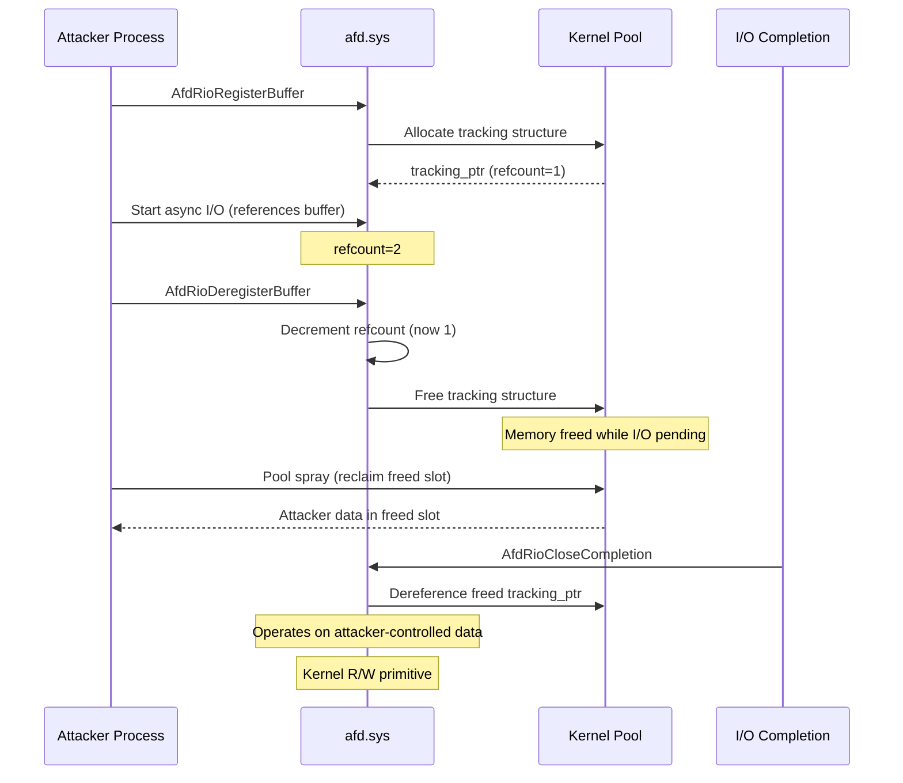

# CVE-2024-38193

> AFD -- use-after-free race on Registered I/O buffers allows EoP

!!! danger "Exploited in the Wild"
    This vulnerability was exploited in the wild before or shortly after patching.

## Summary

| Field | Value |
|-------|-------|
| **Driver** | `afd.sys` |
| **Vulnerability Class** | Use-After-Free / Lifetime |
| **Vulnerable Build** | `10.0.22621.3672` (KB5039212) |
| **Fixed Build** | `10.0.22621.4036` (KB5041585) |
| **Exploited ITW** | Yes |

## Affected Functions

- `AfdRioDeregisterBuffer`
- `AfdRioCloseCompletion`

## Root Cause

The Ancillary Function Driver (`afd.sys`) implements the kernel side of Windows Sockets. It supports Registered I/O (RIO), a high-performance socket API that pre-registers memory buffers with the kernel to eliminate per-operation buffer locking overhead. When an application calls `AfdRioRegisterBuffer`, the driver allocates a tracking structure that holds the buffer's virtual address, length, MDL, and a reference count.

The vulnerability is a lifetime management flaw in the RIO buffer deregistration path. When `AfdRioDeregisterBuffer` is called, it decrements the tracking structure's reference count and frees it. The problem is that this deregistration does not wait for all in-flight I/O operations referencing the buffer to complete. If an asynchronous I/O operation is still pending when the buffer is deregistered, the tracking structure is freed while the I/O completion handler (`AfdRioCloseCompletion`) still holds a pointer to it. When the pending I/O eventually completes, the completion handler dereferences the freed tracking structure.

The freed memory can be reclaimed by the pool allocator and assigned to a new allocation. If the attacker controls the content of that new allocation (via pool spray), the completion handler operates on attacker-controlled data instead of a legitimate tracking structure.

AutoPiff categorizes this as **lifetime_fix** with detection rules:

- `added_refcount_guard`
- `added_use_after_free_guard`
- `added_null_check_before_deref`



## Exploitation

Lazarus Group weaponized this vulnerability as part of their ongoing campaign to deploy the FudModule rootkit. The exploitation sequence leverages the RIO API's control over I/O timing to make the race reliable.

The attacker registers a RIO buffer, starts an asynchronous I/O operation that references it, then races to deregister the buffer while the I/O is still pending. Deregistration frees the tracking structure. The attacker immediately sprays the non-paged pool with objects sized to match the freed tracking structure (typically 0x80-0x100 bytes, using `NtCreateEvent` or pipe attributes). When a spray object reclaims the freed slot, the I/O completion callback fires and operates on the fake object.

The stale field dereferences in the completion handler, now operating on attacker-controlled data, provide an arbitrary kernel read/write primitive. Lazarus used this to overwrite process token structures for SYSTEM escalation, then deployed FudModule v3, the same data-only DKOM rootkit used via CVE-2024-21338. FudModule disables security monitoring callbacks, zeros ETW provider registrations, and hides processes, all through kernel data manipulation without code injection.

## Patch Analysis

KB5040442 (build `10.0.22621.4036`) adds refcount guards in `AfdRioDeregisterBuffer`. The refcount is now incremented before any I/O operation that references the buffer, and deregistration defers freeing until all outstanding operations complete. The tracking structure's lifetime is tied to both explicit deregistration and I/O completion, closing the race window.

The patch also adds null checks before dereferencing the buffer tracking pointer in `AfdRioCloseCompletion` as defense-in-depth. AutoPiff detects this via `added_refcount_guard`, `added_use_after_free_guard`, and `added_null_check_before_deref`.

## Detection

### YARA Rule

```yara
rule CVE_2024_38193_AFD {
    meta:
        description = "Detects vulnerable version of afd.sys (pre-patch)"
        cve = "CVE-2024-38193"
        author = "KernelSight"
        severity = "high"
    strings:
        $mz = { 4D 5A }
        $driver_name = "afd.sys" wide ascii nocase
        $vuln_build = "10.0.22621.3672" wide ascii
        $func_dereg = "AfdRioDeregisterBuffer" ascii
        $func_close = "AfdRioCloseCompletion" ascii
        $func_reg = "AfdRioRegisterBuffer" ascii
    condition:
        $mz at 0 and $driver_name and $vuln_build and 2 of ($func_*)
}
```

### ETW Indicators

| Provider | Event / Signal | Relevance |
|----------|---------------|-----------|
| Microsoft-Windows-WinSock-AFD | RIO buffer registration / deregistration events | Covers the code path where the race occurs |
| Microsoft-Windows-Kernel-Process | Process token modification events | Detects token overwrite used by Lazarus to escalate to SYSTEM |
| Microsoft-Windows-Security-Auditing | Event 4688 (Process Creation) | SYSTEM-level child from a low-privilege parent after AFD socket operations |
| Microsoft-Windows-Kernel-Audit | Object handle audit events | Rapid creation/destruction of AFD socket handles consistent with race exploitation |

### Behavioral Indicators

- Rapid RIO buffer registration (`SIO_REGISTER_BUFFER`) followed by immediate deregistration while async I/O is pending
- NonPagedPoolNx spray targeting the tracking structure's slab size (~0x80-0x100 bytes) via `NtCreateEvent` or pipe attributes
- `_TOKEN.Privileges` modified to include `SeDebugPrivilege` / `SeImpersonatePrivilege` without legitimate elevation
- DKOM artifacts: missing or zeroed ETW provider and security callback registration entries (FudModule signature)
- Low-privilege process creating RIO completion queues and registered buffers at abnormal rates, followed by SYSTEM escalation within the same process lifetime

## Broader Significance

CVE-2024-38193 is Lazarus Group's second use of a Windows built-in driver vulnerability to deploy FudModule (the first being CVE-2024-21338 in `appid.sys`). The shift from BYOVD to exploiting inbox drivers represents an evolution in operational tradecraft: `afd.sys` ships with every Windows installation, loads by default, and cannot be blocklisted. The RIO API, designed for high-performance networking, provides the precise timing control needed to make use-after-free races reliable. The continued deployment of FudModule through different kernel entry points shows a threat actor investing heavily in maintaining kernel-level persistence and EDR evasion capabilities.

## References

- [MSRC Advisory](https://msrc.microsoft.com/update-guide/vulnerability/CVE-2024-38193)
- [Writeup](https://www.gendigital.com/blog/insights/research/lazarus-fudmodule-v3)
