# CVE-2025-21367

> win32k.sys -- race condition allows elevation of privilege

## Summary

| Field | Value |
|-------|-------|
| **Driver** | `win32k.sys` (Win32 Kernel Subsystem) |
| **Vulnerability Class** | Race Condition |
| **CVSS** | 7.8 |
| **Exploited ITW** | No |
| **Patch Date** | February 11, 2025 |

## Root Cause

The Win32 Kernel Subsystem has been a perennial source of privilege escalation bugs, and CVE-2025-21367 continues that tradition. The vulnerability is a race condition in how `win32k.sys` handles concurrent access to shared graphical objects.

When multiple threads issue Win32k system calls that operate on the same window or graphical object, the driver lacks proper synchronization to serialize access. Two threads can enter a code path that reads and modifies the same object state without holding a lock, creating a window where one thread's modifications are partially visible to the other. The result is state corruption: fields that should be updated atomically end up in an inconsistent state.

This kind of race is particularly insidious in win32k because the subsystem manages a large number of reference-counted objects (windows, menus, cursors, surfaces) that are shared across threads within a session. The attack surface for triggering concurrent access is broad.

```mermaid
sequenceDiagram
    participant T1 as Thread 1
    participant W as win32k Object
    participant T2 as Thread 2
    rect rgb(30, 41, 59)
    Note over T1,T2: Race window - no synchronization
    T1->>W: Read object state
    T2->>W: Modify object state
    T1->>W: Write based on stale read
    Note over W: State corruption
    end
```



## Exploitation

An attacker creates two or more threads that issue concurrent Win32k system calls targeting the same shared graphical object. The timing window is tight but raceable: the attacker spins both threads in a loop until the race fires and the object state becomes corrupted.

The corrupted state can manifest in several ways depending on which object fields are affected. In the best case for the attacker, a reference count or pointer field is corrupted, giving a type confusion or use-after-free primitive. From there, standard kernel exploitation techniques (heap spray, token swap) convert the corruption into SYSTEM privileges.

### Exploitation Primitive

```
Two threads issue concurrent Win32k calls on shared object
  --> race condition --> state corruption
  --> kernel memory corruption primitive --> SYSTEM
```

## Broader Significance

Win32k race conditions are a recurring theme in Windows kernel exploitation. The subsystem's design, with shared mutable state across threads and a massive API surface, makes it inherently difficult to get synchronization right everywhere. CVE-2025-21367 joins a long line of win32k race bugs that convert threading errors into SYSTEM escalation. The continued flow of these vulnerabilities suggests that comprehensive locking audits in win32k remain incomplete.

## References

- [MSRC Advisory](https://msrc.microsoft.com/update-guide/vulnerability/CVE-2025-21367)
