# CVE-2025-24983

> win32k.sys -- use-after-free via W32PROCESS race condition, exploited ITW since 2023

!!! danger "Exploited in the Wild"
    Actively exploited since March 2023. Discovered by ESET and delivered via the PipeMagic backdoor.

## Summary

| Field | Value |
|-------|-------|
| **Driver** | `win32k.sys` |
| **Vulnerability Class** | Use-After-Free / Race Condition |
| **CVSS** | 7.0 |
| **Exploited ITW** | Yes (since March 2023) |
| **Patch Date** | March 11, 2025 |

## Affected Functions

- `W32PROCESS` structure management
- `WaitForInputIdle` API path

## Root Cause

Some zero-days are discovered and patched quickly. CVE-2025-24983 was not one of them. ESET researcher Filip Jurcacko discovered that this vulnerability had been actively exploited since March 2023, a full two years before Microsoft patched it in March 2025. The exploit was delivered through the PipeMagic backdoor and primarily targeted legacy Windows versions: Windows 8.1, Server 2012 R2, Windows 10, and Server 2016.

The bug is a use-after-free triggered by a race condition in `win32k.sys`'s management of the `W32PROCESS` structure. The `W32PROCESS` is an internal structure that the Win32 subsystem attaches to every process that initializes a GUI session. The vulnerability surfaces in the `WaitForInputIdle` API path, where the `W32PROCESS` structure is dereferenced one more time than intended.

The race works like this: two threads in the same process access the `W32PROCESS` concurrently. One thread enters a path that decrements the reference count and frees the structure. The other thread, which acquired its reference slightly earlier, still holds a stale pointer. When the second thread dereferences that pointer, it reads freed memory.

```mermaid
sequenceDiagram
    participant T1 as Thread 1
    participant W as W32PROCESS
    participant T2 as Thread 2
    rect rgb(30, 41, 59)
    Note over T1,T2: Race window in WaitForInputIdle path
    T1->>W: Acquire W32PROCESS reference
    T2->>W: Decrement refcount + free
    Note over W: Memory freed
    T1->>W: Dereference stale pointer (UAF)
    Note over W: Reads attacker-controlled data
    end
```



### Vulnerable Code Path

```
WaitForInputIdle
  --> W32PROCESS reference acquisition (race window)
  --> concurrent thread frees W32PROCESS
  --> stale reference dereference (UAF)
```

## Exploitation

The attacker must win a race condition, which requires spinning two threads in a tight loop until the timing aligns. Once the freed `W32PROCESS` memory sits in the kernel pool, the attacker reclaims it with controlled data by spraying allocations of the same size.

When the stale pointer is dereferenced, the kernel reads the attacker's forged `W32PROCESS` structure. The attacker places crafted values in the fields that will be accessed, enabling token manipulation. The current process's token is replaced with the SYSTEM token, completing the escalation.

The fact that the exploit was delivered via PipeMagic, a sophisticated backdoor, and targeted legacy Windows versions suggests a threat actor who valued reliability over novelty. Older Windows versions have fewer mitigations and more predictable heap layouts, making race-based UAF exploitation more consistent.

### Exploitation Primitive

```
Two threads race on W32PROCESS via WaitForInputIdle
  --> one frees, the other dereferences stale pointer
  --> heap spray reclaims freed memory with forged W32PROCESS
  --> token manipulation --> SYSTEM
```

## Broader Significance

CVE-2025-24983 stands out for its two-year exploitation window. The vulnerability was actively used in the wild from March 2023 to March 2025, targeting organizations running legacy Windows versions that are still common in enterprise environments. The PipeMagic delivery mechanism indicates a well-resourced threat actor. For defenders, this case underscores that legacy OS versions remain high-value targets precisely because their attack surface is well-understood and their mitigations are weaker. The win32k subsystem, with its complex object lifecycle and threading model, continues to be the most prolific source of Windows EoP zero-days.

## References

- [MSRC Advisory](https://msrc.microsoft.com/update-guide/vulnerability/CVE-2025-24983)
- [ESET Research on X](https://x.com/ESETresearch/status/1899508656258875756)
- [SecurityWeek -- Patched Zero-Day Exploited for Two Years](https://www.securityweek.com/newly-patched-windows-zero-day-exploited-for-two-years/)
- [Medium -- CVE-2025-24983 Explained & Demonstrated](https://medium.com/@ajithkumara545454/cve-2025-24983-windows-kernel-use-after-free-vulnerability-explained-demonstrated-900d4e252c24)
- [Tenable -- March 2025 Patch Tuesday](https://www.tenable.com/blog/microsofts-march-2025-patch-tuesday-addresses-56-cves-cve-2025-26633-cve-2025-24983)
