# CVE-2025-29824

> clfs.sys -- Common Log File System elevation of privilege via log file metadata corruption

!!! danger "Exploited in the Wild"
    Actively exploited by Storm-2460 threat actor to deploy RansomEXX ransomware in April 2025. Targets included IT and real estate organizations in the United States, financial sector in Venezuela, a Spanish software company, and Saudi retail.

## Summary

| Field | Value |
|-------|-------|
| **Driver** | `clfs.sys` |
| **Vulnerability Class** | [Use-After-Free](../vuln-classes/use-after-free.md) / [Logic Bug](../vuln-classes/logic-bugs.md) |
| **Vulnerable Build** | `10.0.26100.3476` and earlier |
| **Fixed Build** | `10.0.26100.3775` (KB5055523, April 2025) |
| **Exploited ITW** | Yes |

## Affected Functions

- CClfsBaseFilePersisted::LoadContainerQ
- ClfsDecodeBlock
- CClfsBaseFilePersisted::WriteMetadataBlock

## Root Cause

The Common Log File System has been a favorite target for exploit developers since at least CVE-2022-37969. The pattern is always the same: CLFS manages Base Log Files (BLFs) with complex on-disk metadata structures, and the parsing code trusts fields in those structures without adequate validation. CVE-2025-29824 is the April 2025 entry in this ongoing series.

The vulnerability targets the container context structures within a BLF file. When `LoadContainerQ` processes container descriptors from disk, it reads offset values from the base record header that tell it where to find container context data within the file. These offsets are stored in the BLF and are fully attacker-controlled when the attacker creates or modifies the log file.

The function does not validate that these offsets fall within the allocated base record size. If the offsets point beyond the record boundary, the driver reads and writes at invalid locations in the kernel pool. This creates an out-of-bounds access that corrupts adjacent pool memory. When the log is subsequently closed or flushed, the corrupted memory is accessed again, creating a use-after-free condition.

AutoPiff categorizes this as **out-of-bounds write via corrupted metadata offset** with detection rules:

- `added_offset_bounds_check` -- identifies new validation on BLF structure offsets in the patch
- `added_container_count_validation` -- detects container array bounds checking
- `modified_blf_parser_logic` -- flags changes to core BLF parsing routines

## Exploitation

Microsoft Threat Intelligence attributed the exploitation to Storm-2460, a threat actor who deployed the RansomEXX ransomware against targets across multiple continents. The attack chain started with initial access through various means, followed by deployment of the PipeMagic backdoor. The CLFS exploit was the privilege escalation step.

The exploitation follows the established CLFS corruption playbook. The attacker writes a crafted BLF file to disk with manipulated container context offsets. When the kernel opens and processes the log file, the corrupted offsets cause out-of-bounds writes in NonPagedPoolNx.

Before triggering the bug, the attacker sprays the pool with [named pipe objects](../primitives/exploitation/named-pipe-objects.md) to control what sits adjacent to the vulnerable buffer. The OOB write corrupts a pipe attribute entry, which the attacker reads back via `FSCTL_PIPE_GET_ATTRIBUTE` to build an arbitrary read primitive. This read is used to leak kernel addresses (defeating KASLR) and locate the current process's `_EPROCESS` structure.

With addresses in hand, the attacker deploys a second-stage write primitive using the [I/O Ring](../primitives/exploitation/io-ring.md) technique. This stable arbitrary write performs a [token swap](../primitives/exploitation/token-swapping.md): the current process's token pointer is overwritten with the SYSTEM token, achieving full privilege escalation.

After gaining SYSTEM, the exploit injects a payload into `winlogon.exe` and deploys the RansomEXX ransomware. The attack was observed only on Windows 11 24H2 systems.

```mermaid
sequenceDiagram
    participant A as Attacker Process
    participant C as clfs.sys
    participant P as Named Pipe Objects
    participant K as Kernel Pool
    rect rgb(30, 41, 59)
    Note over A,K: Stage 1: Pool grooming + OOB write
    A->>P: Spray named pipe objects in pool
    A->>C: Open crafted BLF with corrupted offsets
    C->>K: OOB write corrupts adjacent pipe attribute
    end
    rect rgb(30, 41, 59)
    Note over A,K: Stage 2: Info leak + arbitrary write
    A->>P: FSCTL_PIPE_GET_ATTRIBUTE reads corrupted entry
    Note over A: KASLR defeated, _EPROCESS located
    A->>K: I/O Ring arbitrary write
    A->>K: Token swap (current token --> SYSTEM token)
    end
    rect rgb(30, 41, 59)
    Note over A,K: Stage 3: Payload deployment
    A->>A: Inject into winlogon.exe
    Note over A: RansomEXX deployment
    end
```



## Patch Analysis

The April 2025 security update adds bounds validation to the BLF metadata parsing routines. `LoadContainerQ` now validates that container context offsets fall within the allocated base record size before dereferencing them. Additional checks were added to `ClfsDecodeBlock` to verify the integrity of sector offset arrays in log block headers.

The patch also introduces stricter validation in `WriteMetadataBlock` to prevent writing corrupted metadata back to disk, reducing the attack surface for persistent BLF manipulation.

AutoPiff detects this change via the `added_offset_bounds_check` rule, which identifies new comparison instructions that validate structure offsets against allocation boundaries before pointer arithmetic operations.

## Detection

### YARA Rule

```yara
rule CVE_2025_29824_CLFS {
    meta:
        description = "Detects vulnerable version of clfs.sys (pre-patch)"
        cve = "CVE-2025-29824"
        author = "KernelSight"
        severity = "high"
    strings:
        $mz = { 4D 5A }
        $driver_name = "clfs.sys" wide ascii nocase
        $internal_name = "InternalName" wide
        $vuln_version = "10.0.26100.3476" wide ascii
        $blf_marker = { 42 4C 46 30 }
        $func_load = "CClfsBaseFilePersisted::LoadContainerQ" ascii
    condition:
        $mz at 0 and $driver_name and $internal_name and $vuln_version
}

rule CVE_2025_29824_BLF_Artifact {
    meta:
        description = "Detects crafted BLF file with suspicious container context offsets"
        cve = "CVE-2025-29824"
        author = "KernelSight"
        severity = "high"
    strings:
        $blf_magic = { 42 4C 46 30 }
        $container_ctx = { 00 00 00 00 ?? ?? ?? ?? FF FF FF FF }
    condition:
        $blf_magic at 0 and $container_ctx
}
```

### ETW Indicators

| Provider | Event / Signal | Relevance |
|----------|---------------|-----------|
| `Microsoft-Windows-CLFS` | BLF file open/create operations | Detects creation or manipulation of CLFS log files, the attack entry point |
| `Microsoft-Windows-Kernel-Audit` | Token modification events | Captures the SYSTEM token swap performed after exploitation |
| `Microsoft-Windows-Security-Auditing` | Event 4688 -- Process creation | Detects `winlogon.exe` spawning unexpected child processes post-injection |
| `Microsoft-Windows-Kernel-Process` | Process token change | Identifies the privilege escalation from standard user to SYSTEM |

### Behavioral Indicators

- An unprivileged user process calling `CreateLogFile` / `AddLogContainer` to create or open BLF log files in user-writable directories, followed immediately by kernel-mode CLFS processing errors
- Heavy `NtFsControlFile` activity with FSCTL_PIPE_GET_ATTRIBUTE indicating named pipe attribute reads used to build the arbitrary-read primitive after pool corruption
- Anomalous NonPagedPoolNx allocation patterns consistent with named pipe object pool spraying preceding the BLF file open
- Sudden token replacement on a low-privilege process (observable via `_EPROCESS.Token` pointer change) escalating to SYSTEM without going through standard UAC or service elevation
- Post-exploitation injection into `winlogon.exe` from a non-SYSTEM process, followed by ransomware file I/O (bulk file renames/encryptions)

## Broader Significance

CVE-2025-29824 is the most fully documented CLFS exploit chain to date, thanks to Microsoft Threat Intelligence's detailed write-up of the Storm-2460 campaign. The exploitation technique, using BLF metadata corruption to achieve pool corruption, then chaining named pipe attribute reads for info leak and I/O Ring for arbitrary write, represents the current state of the art in Windows kernel exploitation. The CLFS subsystem continues to produce exploitable bugs because its on-disk metadata format is complex, its parsing code has historically trusted on-disk values, and the BLF file can be created and modified by any user. Until CLFS metadata parsing is comprehensively hardened, we should expect more entries in this series.

## References

- [MSRC Advisory](https://msrc.microsoft.com/update-guide/vulnerability/CVE-2025-29824)
- [Microsoft Threat Intelligence -- Storm-2460 Analysis](https://www.microsoft.com/en-us/security/blog/2025/04/08/exploitation-of-clfs-zero-day-leads-to-ransomware-activity/)
- [CLFS Deep-Dive](clfs-deep-dive.md)
