# CVE-2025-30400

> Desktop Window Manager -- use-after-free in composition surface handling allows SYSTEM escalation

!!! danger "Exploited in the Wild"
    Actively exploited zero-day. Added to CISA KEV with remediation deadline June 3, 2025.

## Summary

| Field | Value |
|-------|-------|
| **Driver** | `dwmcore.dll` (Desktop Window Manager Core Library) |
| **Vulnerability Class** | Use-After-Free |
| **CVSS** | 7.8 |
| **Exploited ITW** | Yes |
| **Patch Date** | May 13, 2025 |

## Root Cause

The Desktop Window Manager (DWM) runs as a SYSTEM process and composites every visible window on modern Windows. This architectural choice means that any code execution within DWM immediately yields full privileges, with no separate escalation step needed. CVE-2025-30400 provides exactly that: a use-after-free in composition surface handling that gives code execution in the SYSTEM-context DWM process.

The vulnerability occurs during window and composition surface transitions. DWM manages reference-counted objects that represent composition surfaces (the off-screen buffers where window contents are rendered before being composed onto the desktop). When windows are created and destroyed in a carefully timed sequence, a race condition causes one of these surface objects to be freed while a reference to it remains active elsewhere.

The race window exists because the create and destroy paths do not fully serialize their access to the shared surface object. One code path decrements the reference count and frees the object, while another code path, executing concurrently, still holds a pointer to it. When the second path later uses that pointer, it dereferences freed memory.

```mermaid
sequenceDiagram
    participant T1 as Thread 1 (Create)
    participant S as Composition Surface
    participant T2 as Thread 2 (Destroy)
    rect rgb(30, 41, 59)
    Note over T1,T2: Race window in surface lifecycle
    T1->>S: Acquire reference to surface
    T2->>S: Decrement refcount + free surface
    Note over S: Memory freed
    T1->>S: Dereference stale pointer (UAF)
    Note over S: Reads attacker-controlled data
    end
```



## Exploitation

The attacker triggers the race by rapidly creating and destroying windows, forcing the DWM process to allocate and deallocate composition surfaces in a tight loop. The timing needs to align so that a surface is freed between another thread's reference acquisition and its subsequent dereference.

Once the race fires, the freed surface memory sits in the DWM process heap. The attacker reclaims that memory with controlled data through heap spraying (allocating many objects of the same size). When the stale pointer is dereferenced, DWM reads the attacker's forged surface object and follows a function pointer or vtable entry to attacker-controlled code.

Because DWM runs as SYSTEM, this code execution immediately provides full privileges. No token swap or further escalation is needed.

### Exploitation Primitive

```
Rapid window create/destroy cycle --> composition surface race condition
  --> surface freed while reference remains active
  --> heap spray reclaims freed memory with controlled data
  --> stale pointer dereference --> code execution in DWM (SYSTEM)
```

## Broader Significance

CVE-2025-30400 represents the growing trend of targeting DWM as a privilege escalation vector. Unlike kernel drivers, DWM runs in user mode but as SYSTEM, making it a softer target: it lacks kernel-mode protections like SMEP and HVCI, yet it provides the same privilege level. The composition surface lifecycle, with its reference-counted objects and concurrent access patterns, mirrors the same challenges that produce UAF bugs in win32k. As DWM has grown more complex with each Windows release, its attack surface has expanded accordingly. Combined with [CVE-2025-24058](CVE-2025-24058.md), this makes DWM one of the notable new attack surfaces of 2025.

## References

- [MSRC Advisory](https://msrc.microsoft.com/update-guide/vulnerability/CVE-2025-30400)
- [ZeroPath -- CVE-2025-30400 Exploit Analysis](https://zeropath.com/blog/windows-dwm-cve-2025-30400-exploit)
- [Tenable -- May 2025 Patch Tuesday](https://www.tenable.com/blog/microsofts-may-2025-patch-tuesday-addresses-71-cves-cve-2025-32701-cve-2025-32706)
