# CVE-2025-32709

> afd.sys -- use-after-free after socket closure allows SYSTEM escalation

!!! danger "Exploited in the Wild"
    Actively exploited zero-day targeting healthcare and government sectors since April 2025. Added to CISA KEV.

## Summary

| Field | Value |
|-------|-------|
| **Driver** | `afd.sys` |
| **Vulnerability Class** | Use-After-Free |
| **CVSS** | 7.8 |
| **Exploited ITW** | Yes |
| **Patch Date** | May 13, 2025 |

## Root Cause

Three months after [CVE-2025-21418](CVE-2025-21418.md) (heap overflow in afd.sys, exploited ITW in February), the Ancillary Function Driver for WinSock was back with another zero-day. CVE-2025-32709 is a use-after-free triggered by a race condition during socket closure.

The bug is in the cleanup path. When a socket is closed, `afd.sys` frees the memory blocks associated with the socket's internal state. But the driver does not nullify all pointers to those freed blocks. If a concurrent operation (such as a pending I/O request) still holds a reference to the socket's internal structures, it can dereference them after the free has occurred.

This is a classic case of insufficient lifetime management in concurrent code. The close operation and the pending I/O operation race against each other, and the driver does not serialize them properly. When the I/O operation wins the race and accesses the freed memory, it reads whatever data now occupies that region.

The vulnerability was linked to credential harvesting and ransomware campaigns targeting healthcare and government sectors, indicating that a sophisticated threat actor had weaponized it for targeted operations.

```mermaid
sequenceDiagram
    participant T1 as Thread 1 (I/O)
    participant S as Socket State
    participant T2 as Thread 2 (Close)
    rect rgb(30, 41, 59)
    Note over T1,T2: Race window during socket closure
    T1->>S: Begin pending I/O operation
    T2->>S: Close socket + free internal state
    Note over S: Memory freed, pointers not nullified
    T1->>S: Dereference stale pointer (UAF)
    Note over S: Reads attacker-controlled data
    end
```



## Exploitation

The attacker creates a socket and initiates one or more asynchronous I/O operations on it. While those operations are still pending, a second thread closes the socket. If the timing is right, the close path frees the socket's internal memory while the I/O thread still holds a pointer to it.

The attacker then reclaims the freed memory by spraying allocations of the same size. When the I/O thread dereferences its stale pointer, it reads the attacker's controlled data instead of the original socket state. The corrupted data provides a kernel memory corruption primitive.

From the corruption primitive, the attacker builds a read/write capability and performs a token swap: replacing the current process's token with the SYSTEM token. A low-privilege user escalates to full administrative control.

### Exploitation Primitive

```
Pending I/O on socket + concurrent socket close
  --> afd.sys frees socket state without nullifying pointers
  --> I/O thread dereferences stale pointer (UAF)
  --> heap spray reclaims freed memory
  --> kernel memory corruption --> token swap --> SYSTEM
```

## Broader Significance

`afd.sys` is now a two-time zero-day offender in 2025 alone (CVE-2025-21418 in February, CVE-2025-32709 in May). The driver handles the kernel side of every socket operation on Windows, making it universally present, reachable from any user, and processing complex asynchronous I/O patterns. The socket close race in CVE-2025-32709 is a textbook example of the concurrency bugs that plague WinSock's kernel layer. For threat actors targeting healthcare and government, `afd.sys` provides a reliable local EoP that works across all Windows versions, the exact kind of primitive needed to escalate from an initial foothold to full domain compromise.

## References

- [MSRC Advisory](https://msrc.microsoft.com/update-guide/vulnerability/CVE-2025-32709)
- [ZeroPath -- CVE-2025-32709 Analysis](https://zeropath.com/blog/windows-afd-cve-2025-32709-use-after-free)
- [Ampcus Cyber -- Privilege Escalation via afd.sys](https://www.ampcuscyber.com/shadowopsintel/cve-2025-32709-privilege-escalation-via-afd-sys-actively-exploited-in-targeted-attacks/)
