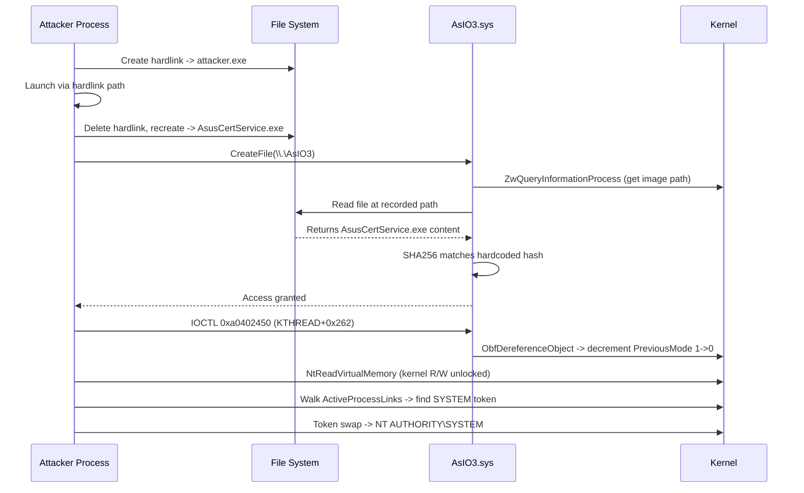

# CVE-2025-3464

> AsIO3.sys -- authorization bypass via hardlink attack enables decrement-by-one primitive and SYSTEM escalation

## Summary

| Field | Value |
|-------|-------|
| **Driver** | `AsIO3.sys` |
| **Vendor** | ASUS |
| **Vulnerability Class** | Authorization Bypass / Arbitrary Decrement |
| **TALOS ID** | TALOS-2025-2150 |
| **Exploited ITW** | No |
| **Status** | Blocklisted |

## Affected Functions

- `ImageHashCheck` (called from `IRP_MJ_CREATE` handler)
- `ObfDereferenceObject` (abused via IOCTL `0xa0402450`)
- `ZwQueryInformationProcess` (used in authorization)

## Root Cause

Marcin Noga at Cisco Talos discovered an elegant two-stage vulnerability in the ASUS AsIO3 driver. The story begins with a deceptively simple question: how does the driver decide who is allowed to talk to it?

The answer is a SHA256 hash check. When a process opens a handle to the AsIO3 device, the `IRP_MJ_CREATE` handler calls `ZwQueryInformationProcess` to retrieve the image path from the calling process's `EPROCESS` structure. It then reads the file at that path, computes its SHA256 hash, and compares the result against a hardcoded value (`c5c176fc...`) that corresponds to `AsusCertService.exe`. If the hashes match, the device grants access. If not, the open is rejected.

The flaw is subtle but devastating. `EPROCESS.ImageFileName` records the path used at process creation time, but the file at that path can be replaced after the process starts. The driver hashes whatever file currently sits at the recorded path, not the in-memory image that is actually running. This opens the door to a hardlink attack.

The attacker creates a hardlink pointing to their own executable and launches the process through that link. The `EPROCESS` records the hardlink path. While the process is running, the attacker deletes the hardlink and recreates it pointing to `AsusCertService.exe`. Now when the driver hashes the file at the recorded path, it finds the legitimate ASUS binary. The hash matches, and the attacker's process gains full access to the device.

### Vulnerable Code Path

```
IRP_MJ_CREATE
  -> ZwQueryInformationProcess (gets image path from EPROCESS)
  -> ImageHashCheck (reads and hashes the file at that path)
    -> SHA256 comparison against hardcoded AsusCertService.exe hash
    -> PASS (file was swapped via hardlink after process creation)
```

## Exploitation

With the authorization bypass granting device access, Noga developed a full chain from device handle to SYSTEM shell. The exploit unfolds in four stages.

**Leaking the KTHREAD address.** The exploit starts by calling `NtQuerySystemInformation` with handle enumeration to locate the current thread's `KTHREAD` address in kernel memory. This technique works on Windows builds before 24H2 (build 26100.3476), which later added restrictions that block regular users from leaking kernel object addresses through this API.

**Flipping PreviousMode with a decrement-by-one.** IOCTL `0xa0402450` calls `ObfDereferenceObject` on an attacker-supplied address. Internally, `ObfDereferenceObject` decrements the value at `(object - 0x30)` by one, targeting the reference count field in the `_OBJECT_HEADER` preceding the object body. The `PreviousMode` field sits at offset `0x232` in `KTHREAD` and defaults to `1` (UserMode). By passing `KTHREAD + 0x232 + 0x30` as the object address, the exploit decrements PreviousMode from 1 to 0 (KernelMode). With PreviousMode set to 0, all subsequent `ProbeForRead` and `ProbeForWrite` calls become no-ops, and the thread gains kernel-level access to Nt* system calls.

**Walking to the SYSTEM token.** With kernel read access via the PreviousMode flip, the exploit reads `KTHREAD.ApcState.Process` to get the current `EPROCESS` address, walks the `ActiveProcessLinks` doubly-linked list to find the SYSTEM process (PID 4), and reads its `_TOKEN` pointer.

**Token swap.** The final step replaces the current process's token pointer with the SYSTEM token, increments the SYSTEM token's reference count to prevent a BSOD during process teardown, and launches `cmd.exe` as NT AUTHORITY\SYSTEM.



### Exploitation Primitive

```
Hardlink auth bypass (CVE-2025-3464)
  -> Device handle to AsIO3.sys
  -> IOCTL 0xa0402450 (ObfDereferenceObject)
  -> Decrement-by-one at arbitrary kernel address
  -> PreviousMode 1->0 (UserMode -> KernelMode)
  -> Full kernel R/W via Nt* syscalls
  -> ActiveProcessLinks traversal -> SYSTEM token
  -> Token swap -> NT AUTHORITY\SYSTEM
```

## Other Driver Capabilities

The driver exposes additional primitives that were considered but not used in the final chain:

| IOCTL | Capability | Limitation |
|-------|-----------|------------|
| `0xA040200C` | Physical memory mapping (MmMapIoSpace) | `checkPhyMemoryRange` restricts to predefined `g_goodRanges`; blocks Low Stub and arbitrary phys-to-virt translation |
| `0xA040A45C` | MSR register read/write | Allowlist filtering excludes critical registers (IA32_LSTAR at `0xC0000082`, IA32_SYSENTER_EIP at `0x176`) |
| `0xa0402450` | `ObfDereferenceObject` on controlled address | Used in the exploit; provides decrement-by-one primitive |

The physical memory IOCTL has range filtering (`g_goodRanges`), and the MSR IOCTL has an allowlist. The researchers note that allowlist-based filtering (rather than blocklist) is the stronger approach, but even the allowlist here did not prevent exploitation via the `ObfDereferenceObject` path.

## Windows Mitigations Encountered

The initial exploit was developed on build 22621.4890. The Windows 11 24H2 update (build 26100.3476) added a mitigation that prevents regular users from leaking kernel module and thread addresses via `NtQuerySystemInformation`, closing the KTHREAD address leak used in the first stage. This broke the exploit on updated systems.

## Patch Analysis

The fix needs to address the authorization mechanism at its foundation rather than patching individual code paths. The hardlink attack works because the driver trusts the file system path recorded in `EPROCESS` without verifying the process image integrity at the time of access.

Stronger approaches include:

- Verify the in-memory image hash (not the on-disk file)
- Use code integrity APIs (`CI.dll`) to validate the caller
- Restrict device access to specific privileged users or groups
- Remove or restrict the `ObfDereferenceObject` IOCTL entirely

## Detection

### YARA Rule

```yara
rule CVE_2025_3464_AsIO3 {
    meta:
        description = "Detects AsIO3.sys versions vulnerable to authorization bypass"
        cve = "CVE-2025-3464"
        author = "KernelSight"
        severity = "critical"
    strings:
        $mz = { 4D 5A }
        $driver_name = "AsIO3" wide ascii nocase
        $hash_func = "ImageHashCheck" ascii
        $cert_svc = "AsusCertService" wide ascii
        $sha256_hash = { c5 c1 76 fc 0c bf 4c c4 e3 7c 84 b6 23 73 92 b8 }
    condition:
        $mz at 0 and $driver_name and ($hash_func or $cert_svc or $sha256_hash)
}
```

### ETW Indicators

| Provider | Event / Signal | Relevance |
|----------|---------------|-----------|
| Microsoft-Windows-Kernel-File | Hardlink creation / deletion | Rapid hardlink create-delete-recreate cycle targeting a signed executable |
| Sysmon | Event ID 11 -- File created | Hardlink creation to AsusCertService.exe |
| Microsoft-Windows-Kernel-Process | Process token modification | Token pointer swap after PreviousMode flip |
| Microsoft-Windows-Security-Auditing | Event 4672 -- Special Privileges | SYSTEM privileges appearing in a non-elevated process |

### Behavioral Indicators

- Hardlink creation targeting `AsusCertService.exe` followed by device open to `\\.\AsIO3`
- Rapid hardlink delete and recreate from a non-ASUS process
- `NtQuerySystemInformation(SystemHandleInformation)` calls preceding IOCTL activity to AsIO3
- Process token changing to SYSTEM token without UAC elevation
- Non-ASUS process sending IOCTL `0xa0402450` to the AsIO3 device

## Techniques Used

| Technique | KernelSight Page |
|-----------|-----------------|
| Arbitrary Decrement (ObfDereferenceObject) | [Arb Increment/Decrement](../primitives/arw/arb-increment-decrement.md) |
| PreviousMode Manipulation | [PreviousMode Manipulation](../primitives/exploitation/previous-mode-manipulation.md) |
| Token Swapping | [Token Swapping](../primitives/exploitation/token-swapping.md) |
| KASLR Bypass (NtQuerySystemInformation) | [KASLR Bypasses](../mitigations/kaslr-bypasses.md) |

## Broader Significance

This case study is a masterclass in chaining subtle primitives. The authorization bypass is not a buffer overflow or a type confusion. It is a logical gap in the trust model: the driver assumes the file at a path is the same file that was there when the process started. The decrement-by-one through `ObfDereferenceObject` is equally subtle; it is not arbitrary write, just a single byte decrement, yet it is enough to flip PreviousMode and unlock the entire kernel address space. Together, they demonstrate that the most dangerous vulnerabilities are not always the most obvious ones.

## Timeline

| Date | Event |
|------|-------|
| 2025-06-26 | Talos publishes full analysis and exploit chain |

## References

- [Talos -- Decrement by one to rule them all: AsIO3.sys driver exploitation](https://blog.talosintelligence.com/decrement-by-one-to-rule-them-all/)
- [TALOS-2025-2150](https://www.talosintelligence.com/vulnerability_reports/TALOS-2025-2150)
- [CVE-2025-1533 -- Stack overflow in same driver](CVE-2025-1533.md)
- [AsIO3.sys -- Driver overview](AsIO3-sys.md)
