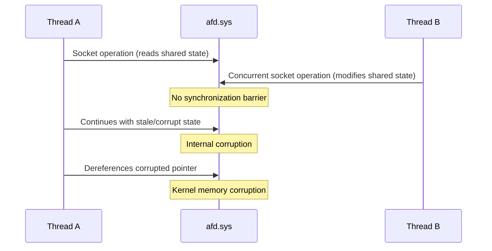

# CVE-2025-49762

> afd.sys -- race condition allows elevation of privilege

## Summary

| Field | Value |
|-------|-------|
| **Driver** | `afd.sys` |
| **Vulnerability Class** | Race Condition |
| **CVSS** | 7.0 |
| **Exploited ITW** | No |
| **Patch Date** | July 8, 2025 |

## Root Cause

The Ancillary Function Driver for WinSock (`afd.sys`) handles socket operations from user-mode applications. Sockets are inherently concurrent objects: multiple threads in the same process may read from, write to, close, or reconfigure a socket simultaneously. The kernel must serialize these operations to maintain consistent internal state.

In this case, the driver fails to properly synchronize concurrent operations on shared socket state. When two threads race on the same socket endpoint, there is a window where both threads access internal data structures without holding appropriate locks. One thread's modifications become visible to the other in a partially-applied state, corrupting the driver's internal bookkeeping.

The CVSS score of 7.0 (rather than 7.8) reflects the race condition's inherent unreliability. The attacker must win a timing window, which means exploitation requires multiple attempts or careful thread scheduling to achieve reliable results.

## Exploitation

The attacker spawns multiple threads that perform concurrent socket operations targeting the same endpoint. The goal is to hit the unsynchronized window where both threads are modifying shared state simultaneously. When the race is won, the resulting state corruption gives the attacker a kernel memory corruption primitive.

The corruption can manifest as a stale pointer, a type confusion, or a size mismatch, depending on exactly how the race resolves. In each case, the corrupted state can be leveraged through heap grooming and controlled data placement to achieve privilege escalation to SYSTEM.



### Exploitation Primitive

```
Concurrent socket operations on shared endpoint -> race condition
  -> state corruption -> kernel memory corruption -> SYSTEM
```

## Broader Significance

Race conditions in `afd.sys` are a recurring theme. The driver must handle concurrent socket operations from multi-threaded applications, and every synchronization gap is a potential vulnerability. The lower CVSS score compared to deterministic AFD bugs (like CVE-2025-49661) reflects the practical difficulty of winning races, but kernel race conditions have been reliably weaponized in the wild. Thread pinning, priority manipulation, and careful timing can turn even tight race windows into reliable exploits.

## References

- [MSRC Advisory](https://msrc.microsoft.com/update-guide/vulnerability/CVE-2025-49762)
