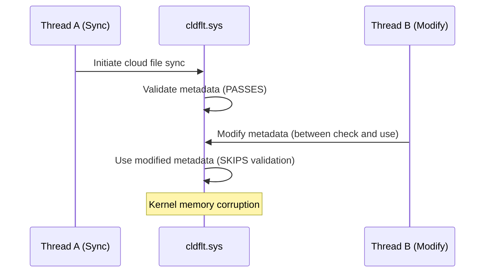

# CVE-2025-55680

> cldflt.sys -- TOCTOU race condition allows elevation of privilege

## Summary

| Field | Value |
|-------|-------|
| **Driver** | `cldflt.sys` |
| **Vulnerability Class** | Race Condition / TOCTOU |
| **CVSS** | 7.0 |
| **Exploited ITW** | No |
| **Patch Date** | October 14, 2025 |

## Root Cause

The Cloud Files Mini Filter driver (`cldflt.sys`) manages synchronization between local files and cloud storage providers like OneDrive and SharePoint. It intercepts file system operations to determine whether a file needs to be hydrated (downloaded from the cloud) or dehydrated (released back to placeholder state).

The vulnerability is a time-of-check-to-time-of-use (TOCTOU) race. During cloud file sync operations, the driver validates a piece of data and then uses it in a subsequent operation. Between the validation and the use, the attacker modifies the data, causing the driver to operate on values that did not pass the validation check.

The TOCTOU window is inherent to the driver's architecture: it must check properties of file operations and then act on them, and the file system allows concurrent modifications from other threads during that gap. The specific data being modified between check and use is related to file metadata or buffer descriptors in the sync path.

Security Online published an analysis detailing how the race manifests in the cloud file synchronization workflow.

## Exploitation

The attacker sets up a cloud file sync scenario and races a modification against the driver's validation check. This requires precise thread timing: one thread triggers the legitimate sync operation (causing the driver to validate the data), while a second thread modifies the data before the driver uses it.

When the race is won, the driver processes the modified (unvalidated) data, leading to kernel memory corruption. The corruption can be shaped through controlled modifications to achieve a write primitive, which the attacker uses for SYSTEM privilege escalation.

The CVSS score of 7.0 reflects the race condition's requirement for precise timing, making exploitation less reliable than deterministic bugs.



### Exploitation Primitive

```
Cloud file sync operation -> cldflt.sys validates data
  -> attacker modifies data between check and use
  -> driver uses unvalidated data -> kernel memory corruption -> SYSTEM
```

## Broader Significance

`cldflt.sys` has become a recurring entry in KernelSight, appearing in CVE-2023-36036, CVE-2024-30085, CVE-2024-49114, and now CVE-2025-55680 (with CVE-2025-62221 following in December 2025). The driver's position as a minifilter that intercepts file system operations and manages complex synchronization state makes it a natural source of concurrency bugs. As cloud file synchronization becomes ubiquitous in enterprise environments, this attack surface is present on virtually every domain-joined Windows workstation.

## References

- [MSRC Advisory](https://msrc.microsoft.com/update-guide/vulnerability/CVE-2025-55680)
- [Security Online -- CVE-2025-55680 Analysis](https://securityonline.info/researcher-details-windows-cloud-files-mini-filter-driver-elevation-of-privilege-flaw-cve-2025-55680/)
