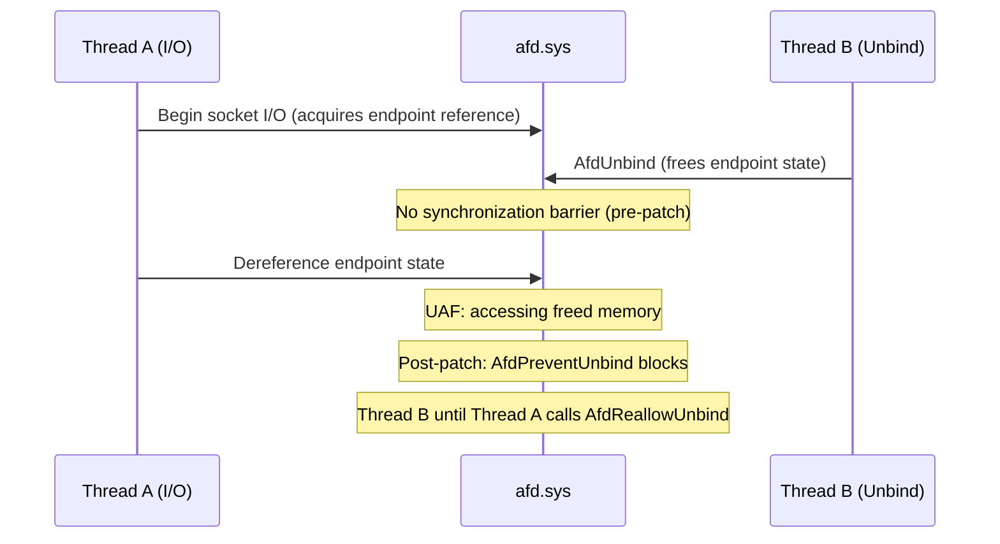

# CVE-2025-60719

> afd.sys -- use-after-free from race between socket unbind and concurrent operations

## Summary

| Field | Value |
|-------|-------|
| **Driver** | `afd.sys` |
| **Vulnerability Class** | Use-After-Free / Race Condition |
| **CVSS** | 7.8 |
| **Exploited ITW** | No (rated "Exploitation More Likely") |
| **Patch Date** | November 11, 2025 |

## Root Cause

Of the multiple `afd.sys` use-after-free vulnerabilities tracked in KernelSight, CVE-2025-60719 stands out for having the most detailed public root cause analysis, courtesy of Akamai and IBM X-Force.

The vulnerability is a race condition between the socket unbind path and concurrent I/O operations. When a socket endpoint is unbound (disconnected from its local address), the driver frees the internal state associated with that binding. The problem is that other operations, running on different threads, may still be actively dereferencing that state.

The driver lacks synchronization between the unbind path and concurrent I/O paths. Thread A begins a socket I/O operation that reads the endpoint's bound state. Before Thread A finishes, Thread B calls unbind, which frees the endpoint state. Thread A then dereferences the now-freed memory, producing a classic use-after-free.

Akamai's root cause analysis revealed that the patch introduced two new functions: `AfdPreventUnbind` and `AfdReallowUnbind`. These act as synchronization barriers that serialize the unbind operation against concurrent access. `AfdPreventUnbind` blocks unbind while I/O operations hold references to the endpoint state, and `AfdReallowUnbind` releases the barrier after the operation completes.

The vulnerability affects all Windows versions from Server 2008 SP2 through Server 2025, indicating that the missing synchronization existed since the driver's original implementation of the unbind path.



### Vulnerable Code Path

```
Thread A: socket I/O operation (holds reference to endpoint)
Thread B: AfdUnbind (frees endpoint state)
  -> Thread A dereferences freed endpoint -> UAF
```

## Patch Analysis

Microsoft added `AfdPreventUnbind` / `AfdReallowUnbind` synchronization barriers. `AfdPreventUnbind` blocks unbind while I/O operations hold references; `AfdReallowUnbind` releases the barrier after the operation completes. This is a targeted fix that adds locking specifically around the unbind/I/O race rather than introducing a global lock that would impact socket performance.

## Exploitation

The race between unbind and concurrent socket operations produces a UAF where the freed endpoint memory can be reclaimed with controlled data. IBM X-Force published an analysis titled "Patch Tuesday to Exploit Wednesday" examining the practical exploitability of this vulnerability, highlighting how quickly the gap between patch release and working exploit can close when detailed root cause analysis is available.

The freed endpoint memory resides in the NonPagedPoolNx. The attacker sprays the pool to reclaim the freed allocation with controlled data. When Thread A's I/O operation dereferences the stale pointer, it operates on the attacker's data, providing a kernel memory corruption primitive.

Microsoft rated this vulnerability as "Exploitation More Likely," reflecting the deterministic nature of the UAF once the race is won and the availability of detailed public analysis.

### Exploitation Primitive

```
Socket unbind race -> UAF in afd.sys
  -> heap reclaim with controlled data
  -> kernel memory corruption -> SYSTEM
```

## Broader Significance

CVE-2025-60719 is one of the best-documented `afd.sys` vulnerabilities thanks to independent analyses from both Akamai and IBM X-Force. The Akamai analysis is particularly valuable because it reverse-engineered the exact patch (the `AfdPreventUnbind`/`AfdReallowUnbind` barrier), demonstrating a general methodology for understanding kernel patches through binary diffing. The IBM X-Force work shows the practical timeline from patch analysis to exploit development, reinforcing why rapid patching matters.

## References

- [MSRC Advisory](https://msrc.microsoft.com/update-guide/vulnerability/CVE-2025-60719)
- [Akamai -- Root Cause Analysis](https://www.akamai.com/blog/security-research/inside-fix-ai-root-cause-analysis-cve-2025-60719)
- [GitHub -- Akamai CVE-2025-60719 Analysis](https://github.com/akamai/CVE-2025-60719-AFD.SYS)
- [IBM X-Force -- Patch Tuesday to Exploit Wednesday](https://www.ibm.com/think/x-force/patch-tuesday-exploit-wednesday-pwning-windows-ancillary-function-driver-winsock)
