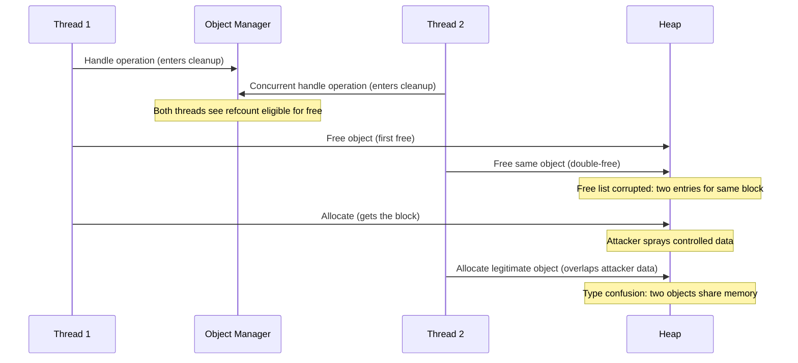

# CVE-2025-62215

> ntoskrnl.exe -- race condition causes double-free in kernel heap, exploited in the wild

!!! danger "Exploited in the Wild"
    Actively exploited zero-day. Discovered by MSTIC and MSRC. Added to CISA KEV.

## Summary

| Field | Value |
|-------|-------|
| **Driver** | `ntoskrnl.exe` |
| **Vulnerability Class** | Race Condition / Double-Free |
| **CVSS** | 7.0 |
| **Exploited ITW** | Yes |
| **Patch Date** | November 11, 2025 |

## Root Cause

CVE-2025-62215 is a zero-day discovered by Microsoft's own Threat Intelligence Center (MSTIC) and Microsoft Security Response Center (MSRC) during investigation of active exploitation. The vulnerability sits in the NT kernel itself, in the Object Manager's handling of concurrent handle operations.

The flaw is a race condition in how the Object Manager processes concurrent operations on a shared kernel object. When multiple threads operate on the same object handle simultaneously, the Object Manager fails to properly serialize certain operations. Two threads can enter the cleanup path for the same allocation, each believing it holds the last reference. Both threads proceed to free the same heap block, producing a double-free.

The double-free corrupts the kernel heap's free list metadata. The allocator now has two entries pointing to the same memory region. When subsequent allocations are serviced from these entries, two different kernel objects end up occupying the same physical memory, creating a powerful type confusion primitive.

The vulnerability affects all supported Windows editions, including Server and Windows 10 ESU, indicating that the missing synchronization has been present in the Object Manager for a long time.

## Exploitation

Public proof-of-concept code demonstrates the exploitation strategy using 16 concurrent threads that perform handle manipulation operations designed to maximize the probability of hitting the race window. The high thread count is deliberate: more threads increase the chance that two threads enter the cleanup path simultaneously.

Once the double-free fires, the attacker sprays controlled data into the kernel heap to occupy the double-freed region. When the second allocation is serviced from the corrupted free list, a legitimate kernel object overlaps with the attacker's data. The attacker uses this overlap to read and modify the legitimate object's fields, including token pointers.

The final step is token manipulation: the attacker overwrites the current process's token pointer with a reference to the SYSTEM token, achieving full privilege escalation.



### Exploitation Primitive

```
16-thread concurrent handle manipulation -> Object Manager race
  -> double-free in kernel heap
  -> heap spray reclaims freed region
  -> type confusion via overlapping allocations
  -> token manipulation -> SYSTEM
```

## Broader Significance

A zero-day in `ntoskrnl.exe` discovered through active exploitation is always significant. The Object Manager is one of the most fundamental components of the NT kernel, responsible for managing every kernel object (processes, threads, files, mutexes, and more). A synchronization flaw at this level affects the entire kernel, not just a specific driver or subsystem.

The discovery by MSTIC (threat intelligence) rather than MSRC (proactive security research) indicates that this vulnerability was found because attackers were already using it, not because Microsoft found it through internal auditing. This pattern, where zero-days in core kernel components are discovered through exploitation telemetry rather than proactive research, highlights the ongoing challenge of auditing concurrency in complex kernel code.

CISA's addition to the KEV catalog makes patching mandatory for federal agencies and signals the severity to the broader enterprise community.

## References

- [MSRC Advisory](https://msrc.microsoft.com/update-guide/vulnerability/CVE-2025-62215)
- [SOC Prime -- CVE-2025-62215 Analysis](https://socprime.com/blog/latest-threats/cve-2025-62215-windows-kernel-vulnerability/)
- [GitHub PoC -- 16-thread strategy](https://github.com/dexterm300/CVE-2025-62215-exploit-poc)
- [HelpNetSecurity -- November 2025 Patch Tuesday](https://www.helpnetsecurity.com/2025/11/12/patch-tuesday-microsoft-cve-2025-62215/)
