# CVE-2026-21231

> ntoskrnl.exe -- race condition with improper synchronization allows SYSTEM escalation, actively exploited and added to CISA KEV

!!! danger "Exploited in the Wild"
    Actively exploited. Added to CISA KEV with remediation deadline March 3, 2026.

## Summary

| Field | Value |
|-------|-------|
| **Driver** | `ntoskrnl.exe` |
| **Vulnerability Class** | Race Condition |
| **CVSS** | 7.8 |
| **Exploited ITW** | Yes |
| **Patch Date** | February 10, 2026 |

## Context

When CISA adds a vulnerability to its Known Exploited Vulnerabilities catalog with a remediation deadline, it means the bug is being actively used in attacks against U.S. federal agencies or their suppliers. CVE-2026-21231 received that designation, joining the small group of ntoskrnl.exe race conditions that have been exploited in the wild alongside [CVE-2024-30088](CVE-2024-30088.md) and [CVE-2024-38106](CVE-2024-38106.md).

Race conditions in ntoskrnl.exe are among the most challenging kernel bugs to exploit reliably, but they are also among the most valuable. The NT kernel is the most privileged component in the Windows security model, and a race condition that corrupts kernel memory provides a primitive that bypasses all user-mode and kernel-mode mitigations. The difficulty of exploitation is offset by the value of the result.

## Root Cause

The vulnerability is a CWE-362 concurrent execution issue: a shared kernel resource lacks proper synchronization, allowing two or more threads to access it simultaneously without the necessary locking. When the attacker wins the race, the concurrent access corrupts the kernel resource's state, leading to memory corruption.

The specific resource and synchronization primitive have not been publicly disclosed. Based on the pattern of ntoskrnl.exe race conditions in this corpus, the bug likely involves a TOCTOU (time-of-check-time-of-use) gap where the kernel validates a parameter, releases a lock, and then uses the parameter. Between the lock release and the use, an attacker thread modifies the validated value.

```mermaid
sequenceDiagram
    participant T1 as Thread 1 (Attacker)
    participant K as Kernel Resource
    participant T2 as Thread 2 (Attacker)

    rect rgb(30, 41, 59)
    T1->>K: Validate parameter (check)
    Note over K: Lock released
    T2->>K: Modify shared state
    T1->>K: Use parameter (use) -- now stale
    Note over K: Memory corruption
    end
```



## Exploitation

The attacker spawns multiple threads that race against the shared kernel resource. Each thread performs operations that compete for the same kernel state, attempting to win the race and corrupt memory. Reliable exploitation of kernel race conditions typically requires careful timing, often achieved through CPU affinity pinning and priority manipulation to maximize the probability of hitting the race window.

Once the race is won, the corrupted kernel state provides a memory corruption primitive. The attacker uses this to modify kernel data structures for privilege escalation, ultimately achieving SYSTEM.

### Exploitation Primitive

```
Race condition on shared kernel resource --> memory corruption --> SYSTEM
```

## Broader Significance

CVE-2026-21231 is the third ntoskrnl.exe race condition exploited in the wild in two years. This pattern suggests that attackers have developed reliable techniques for winning kernel race conditions, which were historically considered too unreliable for production exploits. The addition to CISA KEV confirms that race condition exploitation has matured from a research curiosity to a practical attack technique used in real intrusions.

## References

- [NVD Detail](https://nvd.nist.gov/vuln/detail/CVE-2026-21231)
- [CISA KEV Addition](https://www.cisa.gov/news-events/alerts/2026/02/10/cisa-adds-six-known-exploited-vulnerabilities-catalog)
- [Petri.com -- CISA Critical Windows Kernel Flaw](https://petri.com/cisa-critical-windows-kernel-flaw/)
