# CVE-2026-21241

> AFD -- race condition in AfdNotifyPostEvents spinlock release creates a use-after-free with a seven-stage exploitation chain

## Summary

| Field | Value |
|-------|-------|
| **Driver** | `afd.sys` |
| **Vulnerability Class** | Use-After-Free / Race Condition |
| **Exploited ITW** | No |

## Affected Functions

- `AfdNotifyPostEvents`
- `AfdNotifySock`
- `AfdCleanupNotify`

## Context

CVE-2026-21241 is one of the most thoroughly documented AFD vulnerabilities in this corpus, with three independent writeups published. The bug combines a race condition with a use-after-free, and the published exploit chains demonstrate a modern, kCFG-compliant exploitation technique that avoids shellcode entirely. Instead, the attacker uses kernel API functions (`RtlClearAllBits` and `RtlSetBit`) as legitimate indirect call targets to build a bit-manipulation primitive that incrementally corrupts kernel security structures.

The exploitation chain is notable for its sophistication. Rather than the traditional "corrupt token pointer" approach, the exploit disables two separate kernel security mechanisms (the `SepMediumDaclSd` DACL and a WIL feature flag) to leak kernel addresses, then uses the same bit-manipulation primitive to enable `SeDebugPrivilege` in the current process token. Each step uses only kCFG-valid function pointers, making the chain resilient to Control Flow Guard enforcement.

## Root Cause

The race lives in the event notification subsystem of the AFD driver. `AfdNotifyPostEvents` acquires a spinlock to manipulate the notification list and complete an associated I/O request. It then releases the spinlock *before* performing its final dereference of the notification object (pool tag `AfdN`, 0x70 bytes, NonPagedPoolNx).

Between the spinlock release and that final dereference, a concurrent `AfdCleanupNotify` call on another thread can observe the notification as completed and unprotected. The cleanup path frees the `AfdN` object. When `AfdNotifyPostEvents` resumes and dereferences the now-freed pointer, it accesses memory that has returned to the kernel pool.

The freed 0x70-byte slot is reclaimable via pool spray with controlled data. The stale pointer dereference then operates on attacker-supplied content.

```mermaid
sequenceDiagram
    participant T1 as Thread 1 (AfdNotifyPostEvents)
    participant Pool as Kernel Pool (AfdN 0x70)
    participant T2 as Thread 2 (AfdCleanupNotify)

    rect rgb(30, 41, 59)
    T1->>Pool: Acquire spinlock, complete I/O
    T1->>Pool: Release spinlock
    Note over Pool: Race window opens
    T2->>Pool: See notification completed
    T2->>Pool: Free AfdN object
    Note over Pool: 0x70 bytes returned to pool
    T1->>Pool: Dereference freed pointer (UAF)
    end
```



### Vulnerable Code Path

```
AfdNotifySock (user request via WSAWaitForMultipleEvents / NtDeviceIoControlFile)
  --> AfdNotifyPostEvents (processes completed notification)
    --> KeReleaseInStackQueuedSpinLock (releases lock)
    --> [RACE WINDOW -- concurrent AfdCleanupNotify frees the AfdN object]
    --> dereference of freed notification object (UAF)
```

## Exploitation

The published exploitation chain unfolds in seven stages, each building on the previous.

**Stage 1: Triggering the UAF.** Socket notification objects populate NonPagedPoolNx with 0x70-byte `AfdN` allocations. Two threads race `AfdNotifyPostEvents` against `AfdCleanupNotify` to free one while a stale reference remains.

**Stage 2: Pool spray with named pipes (NPNX).** The freed slot is reclaimed via `FSCTL_PIPE_INTERNAL_WRITE` (`NtFsControlFile`). Named pipe `DATA_QUEUE_ENTRY` objects (tag `Npfs`, NonPagedPoolNx) can be sized to exactly 0x70 bytes. Thousands of pipe writes ensure reclamation. The spray content overlaps with an `_IO_MINI_COMPLETION_PACKET_USER` structure, with the `ApcContext` callback pointer field pointing to a chosen kernel function.

**Stage 3: kCFG-compliant callback abuse.** When the I/O completion fires on the reclaimed object, the kernel calls the `ApcContext` function pointer through a legitimate indirect call site that passes kCFG validation. The chosen targets are `RtlClearAllBits` and `RtlSetBit`, both valid kCFG targets. Controlling the `RTL_BITMAP` pointer via the fake completion packet yields an arbitrary bit-clear/set primitive at arbitrary kernel addresses.

**Stage 4: SepMediumDaclSd DACL corruption.** `SepMediumDaclSd` is a global security descriptor gating access to `NtQuerySystemInformation(SystemModuleInformation)`. Since Windows 10 20H1, processes below Medium IL are blocked from querying kernel module addresses through this API. Zeroing the DACL removes the restriction, defeating KASLR without a separate info leak.

**Stage 5: WIL feature flag bypass.** A second check still scrubs kernel addresses: the WIL feature flag `Feature_RestrictKernelAddressLeaks__private_featureState`. `RtlSetBit` flips the flag's state bits, disabling scrubbing entirely. Raw kernel pointers now flow to user mode.

**Stage 6: Token privilege escalation.** With the kernel base known, the exploit locates the current process's `_TOKEN`. Rather than swapping the token pointer (which Kernel Data Protection may detect), `RtlSetBit` enables `SeDebugPrivilege` (bit 20) directly in `_TOKEN.Privileges.Enabled`.

**Stage 7: SYSTEM shell.** `SeDebugPrivilege` allows `OpenProcess(PROCESS_ALL_ACCESS)` on a SYSTEM process, then `CreateProcessAsUser` with a duplicated SYSTEM token. Alternative: parent process spoofing via `PROC_THREAD_ATTRIBUTE_PARENT_PROCESS`.

### Exploitation Primitive

```
UAF (0x70 AfdN) --> NPNX pipe spray reclaim --> _IO_MINI_COMPLETION_PACKET_USER callback
  --> RtlClearAllBits/RtlSetBit (bit-manipulation primitive)
  --> SepMediumDaclSd corruption (KASLR bypass step 1)
  --> WIL feature flag disable (KASLR bypass step 2)
  --> Token privilege bit-set (SeDebugPrivilege)
  --> SYSTEM
```

## Patch Analysis

The patch adds reference counting around the notification object in `AfdNotifyPostEvents`. The refcount is incremented before spinlock release, preventing `AfdCleanupNotify` from freeing the object while the stale reference exists. The reference drops only after the final dereference, closing the race window.

### AutoPiff Detection

- `spinlock_acquisition_added` -- Detects extended spinlock hold duration around the notification dereference
- `added_refcount_guard` -- Detects addition of reference count increment before spinlock release
- `added_use_after_free_guard` -- Detects null-check and lifetime guard additions in the notification path

## Detection

### YARA Rule

```yara
rule CVE_2026_21241_AFD {
    meta:
        description = "Detects afd.sys versions vulnerable to notification UAF"
        cve = "CVE-2026-21241"
        author = "KernelSight"
        severity = "high"
    strings:
        $mz = { 4D 5A }
        $driver_name = "afd.sys" wide ascii nocase
        $func_notify = "AfdNotifyPostEvents" ascii
        $func_cleanup = "AfdCleanupNotify" ascii
        $func_sock = "AfdNotifySock" ascii
        $pool_tag = "AfdN" ascii
    condition:
        $mz at 0 and $driver_name and 2 of ($func_*) and $pool_tag
}
```

### ETW Indicators

| Provider | Event / Signal | Relevance |
|----------|---------------|-----------|
| Microsoft-Windows-WinSock-AFD | Socket notification events | Monitors creation and cleanup of notification objects in the race window |
| Microsoft-Windows-Kernel-Process | Process token modification | Detects SeDebugPrivilege appearing in a token without legitimate elevation |
| Microsoft-Windows-Security-Auditing | Event 4672 (Special Privileges) | Flags SeDebugPrivilege assigned without standard UAC elevation |
| Microsoft-Windows-Kernel-Audit | NtQuerySystemInformation calls | Detects SystemModuleInformation queries from unexpected integrity levels |

### Behavioral Indicators

- Rapid creation and teardown of AFD socket notification objects across multiple threads (race attempts against `AfdNotifyPostEvents` / `AfdCleanupNotify`)
- Named pipe spray (`FSCTL_PIPE_INTERNAL_WRITE`) targeting 0x70-byte NonPagedPoolNx allocations immediately after AFD notification cleanup
- Low/Medium IL process successfully calling `NtQuerySystemInformation(SystemModuleInformation)` -- indicates `SepMediumDaclSd` corruption
- `SeDebugPrivilege` in a token not launched via Run As Administrator or UAC
- Parent process spoofing via `PROC_THREAD_ATTRIBUTE_PARENT_PROCESS` targeting a SYSTEM process (`winlogon.exe`, `lsass.exe`)

## Techniques Used

| Technique | KernelSight Page |
|-----------|-----------------|
| Pool Spray (NPNX via named pipes) | [Pool Spray / Feng Shui](../primitives/exploitation/pool-spray-feng-shui.md) |
| Bit-Manipulation Primitive | [Bit-Manipulation Primitives](../primitives/exploitation/bit-manipulation.md) |
| ACL/SD Corruption (SepMediumDaclSd) | [ACL / SD Manipulation](../primitives/exploitation/acl-sd-manipulation.md) |
| KASLR Bypass (WIL feature flag) | [KASLR](../mitigations/kaslr.md) |
| Token Privilege Manipulation | [Token Manipulation](../primitives/arw/token-manipulation.md) |

## Broader Significance

CVE-2026-21241 is a masterclass in modern Windows kernel exploitation. The seven-stage chain demonstrates how attackers adapt to each mitigation layer: kCFG blocks arbitrary indirect calls, so the exploit uses legitimate kernel functions as call targets. KASLR blocks address knowledge, so the exploit corrupts the security descriptor that gates the address leak API, then disables the secondary scrubbing check. Token protection detects pointer swaps, so the exploit modifies privilege bits instead of swapping pointers. Each mitigation narrows the attacker's options without eliminating them, and the result is a more complex but fully functional chain.

## References

- [MSRC Advisory](https://msrc.microsoft.com/update-guide/vulnerability/CVE-2026-21241)
- [Writeup -- jle-k.com](https://jle-k.com/blog/Exploiting+CVE-2026-21241)
- [Writeup -- Souhail Hammou](https://rce4fun.blogspot.com/2026/02/use-after-free-in-afdsys-cve-2026-21241.html)
- [Writeup -- Bad_Jubies](https://bad-jubies.github.io/cve-2026-21241-ancillary-function-driver)
