# Truesight.sys

> Adlice RogueKiller anti-rootkit -- the security tool whose own protection bypass capabilities were turned against the security industry

## Summary

| Field | Value |
|-------|-------|
| **Driver** | `Truesight.sys` |
| **Vendor** | Adlice (RogueKiller) |
| **Vulnerability Class** | Logic Bug / EDR Bypass |
| **Abused Version** | Multiple versions prior to 3.4.0 |
| **Status** | Blocklisted -- added to Microsoft Vulnerable Driver Blocklist (2025) |
| **Exploited ITW** | Yes |

## BYOVD Context

- **Driver signing**: Authenticode-signed by Adlice Software with valid certificate
- **Vulnerable Driver Blocklist**: Included in Microsoft's recommended driver block rules (added 2025)
- **HVCI behavior**: Blocked on HVCI-enabled systems via the blocklist
- **KDU integration**: Not integrated
- **LOLDrivers**: Listed at loldrivers.io

## Affected IOCTLs

- Process handle duplication (bypassing object callbacks and PPL)
- Process termination by PID
- Process memory read/write

## The Anti-Rootkit Turned Weapon

RogueKiller is an anti-rootkit tool designed to detect and remove malware that hides in the kernel. To do its job, it needs capabilities that most software should never have: the ability to bypass process protection mechanisms, duplicate handles with elevated access rights, terminate protected processes, and read/write process memory regardless of protection level. These are exactly the capabilities that make it a perfect BYOVD weapon.

The irony runs deep. `Truesight.sys` was built to bypass the protections that malware uses to defend itself. Threat actors discovered it could just as easily bypass the protections that EDR products use to defend themselves. The driver's handle duplication IOCTL is particularly dangerous because it defeats `ObRegisterCallbacks`, which is the primary mechanism EDR products use to prevent their own handles from being opened with elevated access rights.

Check Point Research published a detailed analysis in 2025 documenting the abuse pattern.

## Root Cause

As an anti-rootkit product, `Truesight.sys` needs to interact with protected processes, open handles that would normally be blocked by `ObRegisterCallbacks`, and terminate processes regardless of their protection level. The driver provides IOCTLs for all of these operations. The security gap is that the driver does not verify who is making these requests. Any process that can open the device handle can use these capabilities, not just the RogueKiller application.

The handle duplication IOCTL is the most dangerous primitive. EDR products register object callbacks (`ObRegisterCallbacks`) to prevent other processes from obtaining full-access handles to their protected processes. `Truesight.sys` duplicates handles at a level that bypasses these callbacks entirely, giving the attacker a `PROCESS_ALL_ACCESS` handle to any protected process on the system.

With that handle, the attacker can terminate the process, read its memory, or write to its memory. The process termination and memory write IOCTLs provide additional paths, but the handle duplication alone is sufficient to defeat most EDR self-protection mechanisms.

## Exploitation

The attack chain leverages the anti-rootkit's capabilities in sequence.

The attacker deploys `Truesight.sys` via BYOVD and opens the device handle. Using the handle duplication IOCTL, they obtain a full-access handle to each EDR process on the system, bypassing the `ObRegisterCallbacks` protections. With these handles, they terminate the EDR processes using the termination IOCTL, or patch the EDR's kernel-mode hooks by writing to its memory. With security products disabled, they execute their primary payload.

```mermaid
sequenceDiagram
    participant A as Attacker Process
    participant T as Truesight.sys
    participant E as EDR Process (PPL)
    participant K as Kernel (ObRegisterCallbacks)

    rect rgb(30, 41, 59)
    A->>T: Open device handle
    A->>T: Handle duplication IOCTL (target: EDR PID)
    T->>K: Duplicate handle (bypasses ObRegisterCallbacks)
    K-->>T: PROCESS_ALL_ACCESS handle
    T-->>A: Full-access handle to EDR
    A->>T: Terminate IOCTL (EDR PID)
    T->>E: ZwTerminateProcess
    Note over E: EDR process killed
    A->>A: Deploy payload
    end
```



## Detection

### YARA Rule

```yara
rule Truesight_sys {
    meta:
        description = "Detects Adlice Truesight.sys vulnerable driver"
        author = "KernelSight"
        severity = "critical"
    strings:
        $mz = { 4D 5A }
        $truesight = "Truesight" wide ascii nocase
        $adlice = "Adlice" wide ascii
        $roguekiller = "RogueKiller" wide ascii
    condition:
        $mz at 0 and ($truesight or $adlice or $roguekiller)
}
```

### ETW Indicators

| Provider | Event / Signal | Relevance |
|----------|---------------|-----------|
| Microsoft-Windows-Kernel-File | Driver load event | Detects loading of Truesight.sys |
| Sysmon | Event ID 6 -- Driver loaded | Hash and signature capture |
| Microsoft-Windows-Security-Auditing | Event 4697 -- Service installed | Service creation |
| Microsoft-Windows-Threat-Intelligence | Handle duplication events | Detects handle elevation to protected processes |
| Microsoft-Windows-Kernel-Process | Process termination events | EDR process termination |

### Behavioral Indicators

- Loading of `Truesight.sys` from outside Adlice RogueKiller installation
- Handle duplication IOCTLs targeting EDR/AV processes (especially PPL-protected processes)
- Process termination of security products following Truesight driver loading
- Temporal pattern: driver load, handle elevation, security process termination, malware execution

## Broader Significance

Truesight.sys is the canonical example of the BYOVD paradox for security products. Tools that detect and remove rootkits need rootkit-like capabilities. Those same capabilities, exposed through unprotected IOCTLs, become the most effective anti-EDR weapons available. The solution is not to remove these capabilities from anti-rootkit tools (they genuinely need them), but to ensure the IOCTLs verify caller identity through mechanisms like process signing validation, token checks, or embedded authentication codes. The BYOVD problem for security product drivers is fundamentally a caller authentication problem.

## References

- [Check Point Research -- Truesight.sys EDR Bypass](https://research.checkpoint.com/)
- [LOLDrivers -- Truesight](https://www.loldrivers.io/)
