# AFD Attack Surface Deep-Dive

No single Windows kernel driver has produced more privilege escalation vulnerabilities than `afd.sys`. With 13 CVEs in the KernelSight corpus and three confirmed in-the-wild exploits (including one attributed to the Lazarus Group), the Ancillary Function Driver for WinSock is the most consistently exploited networking component in the Windows kernel. Its bugs span nearly every vulnerability class: use-after-free, heap overflow, missing validation, integer overflow, and race conditions. What makes AFD remarkable is not any single bug, but the architectural reality that keeps producing them.

## Why AFD Cannot Stop Being Vulnerable

The Ancillary Function Driver sits between every user-mode socket call and the transport layer. When an application calls `connect()`, `send()`, or `recv()`, those calls flow through `ws2_32.dll` into `afd.sys`, which translates them into kernel transport operations via TDI or WSK. Every networked Windows application touches this driver. No special privileges are needed to trigger most of its code paths.

```
User-Mode:  WSASocket() → connect() → send()/recv() → closesocket()
                ↓              ↓            ↓                ↓
Kernel:     AfdCreate    AfdConnect   AfdSend/Recv    AfdCleanup
                ↓              ↓            ↓                ↓
Transport:  TdiOpen      TdiConnect   TdiSend/Recv    TdiClose
```

Five properties make this driver a persistent target:

**Universal reach.** Any process that opens a network socket interacts with `afd.sys`. The attack surface requires nothing beyond standard socket APIs.

**High concurrency.** Socket operations are asynchronous by design. Multiple threads can bind, unbind, send, receive, and close at the same time, and AFD must manage object lifetimes across all of these paths. Get the synchronization wrong in even one path, and you have a use-after-free.

**Complex buffer lifetime.** Registered I/O (introduced in Windows 8) pre-registers user buffers for kernel use, sharing memory between user and kernel mode. The kernel must track buffer validity across async operations that complete out of order. This is where the Lazarus Group found their zero-day.

**Large IOCTL surface.** Beyond standard socket APIs, AFD exposes dozens of internal IOCTLs for Registered I/O registration, notification management, and other subsystem operations. These paths often receive less testing coverage than the core socket lifecycle.

**Legacy code.** Parts of `afd.sys` date back to Windows NT 3.5. TDI is deprecated but still present. Later additions like RIO and the notification system layer on top of old code with no structural redesign.

## The Architecture That Keeps Breaking

### Key Components

**Socket Objects** are kernel structures representing open sockets, tracked via file objects and accessible through handles. Each socket carries state for connection, buffer tracking, and pending I/O.

**TDI / WSK Interface** connects `afd.sys` to transport protocol drivers like `tcpip.sys`. AFD translates user-mode socket operations into TDI (legacy) or WinSock Kernel calls.

**Registered I/O (RIO)** is the high-performance I/O model that uses pre-registered buffers and completion queues. RIO paths share memory between user and kernel mode, making lifetime management significantly harder.

**Notification System** manages asynchronous event delivery to user mode through `AfdNotifyPostEvents` and related functions. This is the subsystem where race conditions cluster.

**I/O Completion** uses I/O completion ports for async operations. Pending IRPs reference socket objects and buffers that must remain valid through completion.

## CVE Timeline

| CVE | Year | Class | ITW | Notes |
|-----|------|-------|-----|-------|
| CVE-2023-21768 | 2023 | Missing ProbeForWrite | No | WinSock IO ring write-what-where |
| CVE-2023-28218 | 2023 | Integer Overflow | No | AfdCopyCMSGBuffer overflow |
| CVE-2024-38193 | 2024 | UAF / Lifetime | Yes | Registered I/O buffer race, Lazarus Group |
| CVE-2025-21418 | 2025 | Buffer Overflow (Heap) | Yes | Heap overflow allowing SYSTEM |
| CVE-2025-32709 | 2025 | UAF | Yes | Socket closure UAF |
| CVE-2025-49661 | 2025 | Untrusted Pointer | No | Pointer dereference in IOCTL handler |
| CVE-2025-49762 | 2025 | Race Condition | No | Concurrent operation race |
| CVE-2025-53147 | 2025 | UAF | No | Object lifetime error |
| CVE-2025-53718 | 2025 | UAF | No | Object lifetime error |
| CVE-2025-60719 | 2025 | UAF / Race | No | Socket unbind race |
| CVE-2025-62213 | 2025 | UAF | No | Object lifetime error |
| CVE-2025-62217 | 2025 | EoP | No | Elevation of privilege |
| CVE-2026-21241 | 2026 | UAF / Race | No | AfdNotifyPostEvents spinlock race |

## The Patterns That Keep Repeating

### Socket Teardown Races

Seven of the thirteen CVEs follow the same pattern. One thread closes or unbinds a socket while another thread still uses the socket object or its buffers. The close path frees the object; the concurrent path dereferences a stale pointer. The race window is typically between spinlock release and object deallocation.

[CVE-2026-21241](CVE-2026-21241.md) illustrates this clearly: the notification spinlock is released before the notification object is fully torn down, so a concurrent `AfdNotifyPostEvents` call can hit freed memory. The window is narrow, but attackers have become skilled at widening it through thread scheduling manipulation.

### Buffer Length Validation Failures

The driver accepts a user-supplied length or size without validating it against the actual buffer allocation. [CVE-2025-21418](CVE-2025-21418.md) is a heap overflow from an unchecked length field. [CVE-2023-28218](CVE-2023-28218.md) is an integer overflow in CMSG buffer size calculation, where the computed allocation size wraps to a small value while the subsequent copy uses the original, much larger size.

### Missing User Buffer Validation

[CVE-2023-21768](CVE-2023-21768.md) is a missing `ProbeForWrite` on an I/O ring buffer pointer. Without the probe, the kernel writes to a user-controlled address, providing a direct write-what-where primitive. This is the simplest class of AFD bug: a single missing check produces a clean exploitation primitive with no race or heap layout dependency.

### Registered I/O Lifetime Management

RIO buffers are pre-registered with the kernel for performance. If a buffer is deregistered while an async operation still references it, the kernel operates on freed memory. [CVE-2024-38193](CVE-2024-38193.md) exploited exactly this gap. The Lazarus Group used it for SYSTEM escalation in targeted campaigns, chaining it with other tooling for full compromise.

## How AFD Exploits Work

A typical `afd.sys` exploitation chain progresses through a recognizable sequence. The attacker starts by creating a socket with `WSASocket()` to allocate the kernel socket object. They then set up concurrent threads, one to trigger the vulnerable operation and another to race the close or unbind path. When the race is won, a use-after-free condition appears on the socket or notification object. The freed pool region gets sprayed with controlled data, typically through named pipe attributes (the NPNX pool spray technique). The stale pointer dereference now reads attacker-controlled data, often a corrupted `_IO_MINI_COMPLETION_PACKET_USER` structure. The corrupted structure gives a bit-manipulation or arbitrary read/write primitive. [CVE-2026-21241](CVE-2026-21241.md) uses `RtlSetBit` and `RtlClearAllBits` as kCFG-compliant primitives, avoiding the need for control-flow hijacking. From there, escalation happens via token swap, privilege bit-set, or DACL corruption to reach SYSTEM.

```mermaid
sequenceDiagram
    participant A as Attacker Thread 1
    participant K as afd.sys (Kernel)
    participant B as Attacker Thread 2
    participant P as Pool Memory

    rect rgb(30, 41, 59)
    A->>K: WSASocket() - allocate socket object
    A->>K: Trigger vulnerable operation
    B->>K: Close/unbind socket (race)
    K->>P: Free socket/notification object
    Note over P: Object freed, memory available
    A->>P: NPNX pool spray (controlled data)
    Note over P: Freed region reclaimed with fake struct
    K->>P: Stale pointer dereference
    Note over K: Reads attacker-controlled data
    K->>K: RtlSetBit / token swap
    Note over A: Process now runs as SYSTEM
    end
```



## The Mitigation Landscape

Microsoft has fixed individual `afd.sys` vulnerabilities with incremental patches: extending spinlock scope, adding reference counting, tightening buffer validation. No structural redesign has been announced. The driver's concurrency model remains the same across all supported Windows versions.

The [Vulnerable Driver Blocklist](../reference/byovd.md) does not apply to `afd.sys` since it ships inbox. HVCI and kCFG constrain exploitation techniques but do not prevent the underlying bugs. The [bit-manipulation primitive](../primitives/exploitation/bit-manipulation.md) from CVE-2026-21241 demonstrates that exploitation still works under kCFG, since the primitive uses legitimate kernel APIs rather than hijacking control flow.

## AutoPiff Detection

AutoPiff monitors `afd.sys` patches for synchronization and lifetime changes:

- `added_spinlock_acquire` - New spin lock acquisition around previously unprotected state access
- `modified_object_free` - Changes to socket or buffer deallocation paths, indicating lifetime fix
- `added_ref_count` - Reference counting additions to object management code
- `added_length_check` - Buffer size validation in IOCTL handlers

## The Broader Pattern

AFD is a case study in what happens when a complex, concurrent, legacy kernel component gets incremental patches instead of structural redesign. The driver's architecture, where multiple threads operate on shared objects with fine-grained locking, creates a combinatorial explosion of possible interleavings. Each patch closes one race window, but the fundamental design keeps producing new ones. Researchers looking for their next LPE should study AFD's notification and RIO subsystems: they combine shared memory, async completion, and reference counting in ways that consistently produce exploitable lifetime errors.

## Related Case Studies

- [CVE-2026-21241](CVE-2026-21241.md) - notification UAF with bit-manipulation primitive
- [CVE-2024-38193](CVE-2024-38193.md) - Registered I/O UAF, Lazarus Group campaign
- [CVE-2025-21418](CVE-2025-21418.md) - heap overflow, exploited ITW
- [CVE-2025-32709](CVE-2025-32709.md) - socket closure UAF, exploited ITW
- [CVE-2023-21768](CVE-2023-21768.md) - missing ProbeForWrite, I/O ring write-what-where

## References

- [Microsoft WinSock Architecture](https://learn.microsoft.com/en-us/windows/win32/winsock/about-winsock)
- [Registered I/O Documentation](https://learn.microsoft.com/en-us/windows/win32/winsock/registered-i-o)
- [Lazarus APT afd.sys Exploitation (Gen Digital)](https://www.gendigital.com/blog/lazarus-apt-exploits-windows-zero-day)
