# CLFS Attack Surface Deep-Dive

If you wanted to design a kernel attack surface optimized for exploitation, you might come up with something close to the Common Log File System. A complex binary file format parsed in ring 0, where every on-disk offset becomes a pointer arithmetic operation, where any unprivileged user can create the files, and where Microsoft patches each individual offset validation one at a time, leaving the underlying architecture intact. Between 2018 and 2025, CLFS accumulated over 30 CVEs. At least six were exploited in the wild, several by ransomware groups running campaigns at scale. The Nokoyawa operators alone burned through two distinct CLFS zero-days in a single year.

## What CLFS Does and Why It Matters

The Common Log File System (`clfs.sys`) is a general-purpose logging subsystem in the Windows kernel. It manages Base Log Files (BLF) and log containers for transactional logging, supporting Active Directory, NTFS transactions, the Windows Update client, and other system components. The design is straightforward: BLF files contain metadata describing the log's configuration and state, while separate container files hold the actual log records.

The trouble is in how the metadata is structured.

## The BLF File Format: A Parser's Nightmare

BLF files contain metadata blocks organized into three major components:

**Control Record** sits at the top level with the log file signature and pointers to other records.

**Base Record** contains arrays of client context and container context structures, plus a symbol table for named log streams. This is where most vulnerabilities live, because these arrays are navigated using offset values stored in the file itself.

**Truncate Record** manages log truncation state for circular logging.

```
CLFS_LOG_BLOCK_HEADER
  - Signature (4 bytes)
  - TotalSectorCount
  - ValidSectorCount
  - Checksum (CRC32)

CLFS_BASE_RECORD_HEADER
  - ClientContextOffset[]
  - ContainerContextOffset[]
  - SymbolTableOffset

CLFS_CLIENT_CONTEXT
  - LogFile pointer
  - MarshalContext
  - Undo/Redo LSN tracking
```

Each metadata block carries a 4-byte signature, CRC32 checksum, and an array of sector offsets used to locate sub-structures within the block. The fundamental problem is architectural: the driver uses file-embedded offsets for pointer arithmetic against kernel pool allocations. Every offset is a corruption opportunity if validation is insufficient.

Containers are separate files that hold actual log record data. A single log can use multiple containers for circular logging. Container descriptors in the base record reference the physical container files by path and store metadata about their current state.

## Why CLFS Is The Number One Target

**Complex file format parsing.** BLF metadata parsing involves extensive pointer arithmetic derived from on-disk offsets. Every offset that is not bounds-checked is a potential out-of-bounds write.

**User-controllable on-disk structures.** Any user can create a log file with `CreateLogFile()` and then manipulate the resulting BLF on disk. The kernel reparses this user-modified file, trusting embedded offsets to navigate structures. The attacker controls the input to the kernel's pointer arithmetic.

**Kernel state reachability.** Corrupted offsets cause the CLFS parser to read or write relative to the base record's pool allocation, reaching into adjacent kernel pool memory. This turns a file format bug into a kernel memory corruption primitive.

**Consistent exploitation pattern.** The same corruption technique (offset manipulation in BLF metadata) works across dozens of CVEs. Each new CLFS CVE is a variation on the same theme, which means exploitation tooling built for one CVE often adapts to the next.

**Incremental patching.** A structural fix would require redesigning the BLF parser with comprehensive bounds checking or sandboxing. Microsoft has instead patched individual offset validations one at a time, fixing the specific offset that was exploited while leaving other unchecked offsets in place. This creates a pattern where each patch closes one hole but the underlying weakness persists.

## CVE Timeline

| CVE | Year | Class | ITW | Notes |
|-----|------|-------|-----|-------|
| CVE-2018-8471 | 2018 | EoP | No | Early CLFS elevation of privilege |
| CVE-2019-1385 | 2019 | EoP | No | CLFS driver privilege escalation |
| CVE-2020-17136 | 2020 | EoP | No | CLFS metadata parsing flaw |
| CVE-2021-31954 | 2021 | EoP | No | CLFS base record corruption |
| CVE-2021-36955 | 2021 | EoP | No | CLFS container context issue |
| CVE-2022-21916 | 2022 | EoP | No | CLFS offset validation bypass |
| CVE-2022-24521 | 2022 | EoP | Yes | Exploited ITW, reported by NSA and CrowdStrike |
| CVE-2022-37969 | 2022 | Logic/Corruption | Yes | First widely publicized CLFS ITW exploit |
| CVE-2023-23376 | 2023 | EoP | Yes | Exploited by Nokoyawa ransomware operators |
| CVE-2023-28252 | 2023 | EoP | Yes | Also Nokoyawa campaign, different root cause |
| CVE-2023-36570 | 2023 | EoP | No | CLFS client context corruption |
| CVE-2024-49138 | 2024 | Heap Overflow | Yes | CLFS heap-based buffer overflow, exploited ITW |
| CVE-2025-29824 | 2025 | EoP | Yes | RansomEXX / Storm-2460 campaign |

## The Corruption Patterns

### Offset Manipulation

The most common variant. A crafted BLF sets `ClientContextOffset` or `ContainerContextOffset` to point outside the base record boundary into adjacent pool memory. When CLFS dereferences this offset relative to the base record allocation, it reads or writes kernel memory belonging to a different object. [CVE-2022-24521](CVE-2022-24521.md) used this to decrement `PreviousMode` directly. [CVE-2023-28252](CVE-2023-28252.md) used it for a relative write into adjacent pool objects.

### Container Count Mismatch

The `cContainers` field is set larger than the actual container descriptor array in the base record. When CLFS iterates over containers, it walks past the array bounds into adjacent memory, producing out-of-bounds reads or writes.

### Symbol Table Corruption

Symbol table entries with invalid offsets cause the BLF parser to dereference pointers outside the base record allocation. [CVE-2022-37969](CVE-2022-37969.md) exploited this through a corrupted `cbSymbolZone` value that pushed `SignaturesOffset` out of bounds, causing the driver to write signature data into adjacent pool memory.

### Checksum Bypass

Certain code paths in CLFS skip CRC32 checksum validation under specific conditions, such as log recovery and certain error paths. This allows tampered metadata blocks to be processed without detection, enabling all of the corruption patterns above.

## The CLFS Exploitation Playbook

Every CLFS exploit follows a recognizable playbook. The attacker starts by creating a log file using `CreateLogFile()`. They close the handle and modify the BLF on disk, corrupting a metadata offset. Then they trigger CLFS to reparse the corrupted BLF, either by calling `FlushLogBuffers()`, `ReadLogRecord()`, or simply reopening the log. The corrupted offset causes an out-of-bounds read or write relative to the base record's pool allocation.

Before triggering the bug, the attacker sprays the paged pool with controlled objects to position them adjacent to where the CLFS metadata will land. Common spray objects include `_WNF_STATE_DATA` (on pre-22H2 builds), pipe attributes, or I/O Ring structures. The OOB write corrupts one of these positioned objects, converting the limited CLFS write into a broader kernel read/write primitive. From there, token swapping or PTE manipulation achieves SYSTEM.

```mermaid
sequenceDiagram
    participant U as User-Mode
    participant D as Disk
    participant C as clfs.sys
    participant P as Kernel Pool

    rect rgb(30, 41, 59)
    U->>C: CreateLogFile() - allocate BLF
    U->>D: Close handle, corrupt BLF offsets
    U->>P: Pool spray (pipe attrs / WNF)
    U->>C: Reopen BLF / FlushLogBuffers
    C->>D: Parse corrupted metadata
    C->>P: OOB write via bad offset
    Note over P: Adjacent object corrupted
    U->>P: Interact with corrupted object
    Note over U: Arbitrary R/W achieved
    U->>U: Token swap → SYSTEM
    end
```



## CLFS Isolation: Microsoft's Structural Response

Microsoft introduced CLFS Isolation in Windows 11 24H2 as a structural hardening effort:

- BLF metadata offsets are now validated against the allocation size before dereferencing
- Container descriptor arrays have explicit bounds checking on iteration count
- Added integrity verification for base record structures during log open and recovery
- Metadata blocks use enhanced validation during reparsing operations

This is a meaningful step, but not a complete redesign. The underlying architecture, where on-disk offsets drive kernel memory access, remains. Incremental hardening continues with each Patch Tuesday as new bypass vectors are discovered. Whether CLFS Isolation truly breaks the exploitation pattern or merely raises the bar will become clear as researchers probe the new validation boundaries.

## AutoPiff Detection

AutoPiff monitors `clfs.sys` patches with specific attention to BLF parser changes:

- `added_offset_bounds_check` - New bounds validation on BLF structure offsets, indicating a previously missing range check
- `added_container_count_validation` - Container array length checks added to iteration loops
- `modified_blf_parser_logic` - Changes to core parsing routines that alter control flow through BLF metadata processing

## The Broader Pattern

CLFS is the canonical example of what happens when a kernel subsystem parses a complex, user-controllable file format without comprehensive input validation. The pattern generalizes beyond CLFS: any kernel component that trusts on-disk offsets for memory operations is likely to produce the same class of bugs. Researchers studying CLFS should recognize that the attack surface is not "the CLFS driver" but rather "kernel file format parsers," a category that includes registry hives (j00ru's 50-CVE audit), font parsers, and image format handlers. The lesson of CLFS is that complex file formats and ring 0 are a consistently dangerous combination, and incremental patching of individual offsets is not a substitute for structural input validation.

## Related Case Studies

- [CVE-2022-37969](CVE-2022-37969.md) - CLFS EoP, exploited in the wild
- [CVE-2023-28252](CVE-2023-28252.md) - CLFS EoP, Nokoyawa ransomware campaign
- [CVE-2024-49138](CVE-2024-49138.md) - CLFS heap overflow, exploited ITW
- [CVE-2025-29824](CVE-2025-29824.md) - Latest CLFS exploitation, Storm-2460

## References

- [Microsoft CLFS Documentation](https://learn.microsoft.com/en-us/windows-hardware/drivers/kernel/introduction-to-the-common-log-file-system)
- [Kaspersky Nokoyawa CLFS Analysis](https://securelist.com/nokoyawa-ransomware-attacks-with-windows-zero-day/109483/)
